== Chapter 1: INTRODUCTION
Robotic vehicles normally use RF for remote-controlling the movement from a distance. This has limited distance range and also interference problems with other close by RF transmitters.  In this project, a small robotic vehicle is built fitted with a mobile phone and acoustically coupled to a circuit that can detect the tones generated by the earphone of the mobile. 

==== MOBILE PHONES
An ordinary mobile phone is used as a remote control. A call is made to the mobile on the robot and picked up manually. Any key pressed on the mobile generates a complex frequency (touch tone), which is heard in the vehicular-mobile.

==== ROBOTIC VEHICLE
The vehicle is controlled with the hand-held mobile by pressing pre-assigned keys, which will be decoded by circuits in the robot and used to control its movements. The robot vehicle has tone decoder circuits and logic gates with relays and DC motors to control it.

==== SURVEILLANCE CAMERA
A mini wireless camera is placed in front of the vehicle, which transmits continuous video, which is received by a small TV kept near the remote mobile. This helps in navigating the mobile when it is not within visible range.

==== WORKING CONTROLS
Keys assigned for control are 1-start; 3- stop; 2-forward; 8-reverse; 4-left; 6-right 0 can be used for self-destruction when used in military warfare. The micro controller can be programmed for other tasks also.

==== WORKING MODEL
A working model will be demonstrated approximately 12” long and 6”high.

==== NOTATIONS USED

|====
| **NOTATION** | **EXPANSION**
| **APC** | Automatic phase control
| **BFO** | Beat frequency oscillator
| **CW** | Continuous transmission
| **DIP** | Dual in line package
| **ECL** | Emitter coupled logic
| **EHF** | Extremely high frequency
| **ELF** | Extremely low frequency
| **EMI** | Electromagnetic interference
| **FSD** | Full scale deflection
| **LNA** | Low noise amplifier
| **MPU** | Microprocessor unit
| **MSI** | Medium scale integrated circuit
| **PCM** | Pulse code modulation
| **PLD** | Programmable Logic Device
| **PRT** | Pulse repetition time
| **SHF** | Super high frequency
| **SIP** | Single in line package
| **SNR** | Signal to noise ratio
| **SWR** | Standing wave ratio
| **VSWR** | Voltage standing wave ratio
|====

In today’s extremely fast-paced life, almost everyone looks for ‘easy living’ solutions, that is, ways and means to carry out their tasks with the minimal efforts. Every single modern device that has been invented, aims exactly at this. There has never been a dearth of people to work on Industrial projects, which is why I decided to focus on the components that would enable a user to control the movement of a robotic vehicle from any remote location.

The telephone is the most wide spread communication device in this world. There is a telephone in every house and cell phones are now rampant use in almost in every strata of our society. Therefore, it is fairly obvious that they would come into use in our daily life system. Millions of people around the world use **cellular phones**. They are such great gadgets - with a cell phone, you can talk to anyone on the planet from just about anywhere!

These days, cell phones provide an incredible array of functions, and new ones are being added at a breakneck pace. Depending on the cell-phone model, you can:<o:p></o:p>

Store contact information, Make task or to-do lists, Keep track of appointments and set reminders, Use the built-in calculator for simple math, Send or receive email, Get information (news, entertainment, stock quotes) from the Internet, Play simple games or even Integrate other devices such as http://electronics.howstuffworks.com/pda.htm[PDAs], http://electronics.howstuffworks.com/mp3-player.htm[MP3 players] and http://electronics.howstuffworks.com/gps.htm[GPS receivers].

The usage of the cellular phone to control other electronic equipment is very unheard of, leave alone controlling a well equipped surveillance robotic vehicle. Hence I decided to undertake this possibility as my project to convert world wide communication tool into a wide range surveillance tool. In the following pages, I have attempted to give a clear idea of the various technology based on which my project has been undertaken.

== TOUCH-TONE DIALING – AN INTRODUCTION
Although most of us take it completely for granted, the telephone we have in our house is one of the most amazing devices ever created. If we want to talk to someone, all we have to do is pick up the phone and dial a few digits. We are instantly connected to that person, and we can have a two-way conversation. The telephone network extends worldwide, so we can reach nearly anyone on the planet. When we compare that to the state of the world just 100 years ago, when it might have taken several weeks to get a one-way written message to someone, we realize just how amazing the telephone is!<o:p></o:p>

When Alexander Graham Bell invented the telephone, it had an extremely simple construction. It consisted of an electromagnetic transmitter and electromagnetic receiver connected together with a battery, and produced sounds too feeble for general applications in a practical telephone system.

Further improvements were made by the development of duplex or hybrid circuits in which most of the electrical energy developed by the transmitter is directed to the distant station, with a minimum entering the speaker receiver. A small multi-winding audio transformer and balancing network, placed inside each telephone, provides the full duplex operation described over a two-wire circuit.

Earlier a rotary dialing system was used. Here, the signal is made up of opening and closing of the circuit, occurring at a rate of about 10 times per second during counter clockwise rotation of the dial. The number that is dialed, with the exception of zero, determines the circuit opens and closes during dialing. When a zero is dialed, the circuit opens and closes ten times.

There were many disadvantages of Dial Pulse System which led to the need of a better transmission method, Touch-tone dialing.

Some of the disadvantages are:

. It was not suited for long distance communication
. It had no reliability
. It was prone to Interference
. It could not be used over microwave systems

A marked improvement over the rotary telephone dial was accomplished through the use of ‘push-button dialing’. This method of dialing is also known as Touch-Tone dialing. This was made possible as a result of solid-state technology and the need for a more rapid and accurate means of dialing. This method also provides a means of communication between the customer’s telephone and other associated equipment, computers for example. The rotary dial was unable to provide this service since it could control only the telephone company local central office equipment.

The push button dial consists of a series of twelve push buttons, ten of them labeled one through zero and two additional buttons used for specialized functions. When any one button is pressed, a solid state circuit inside the telephone set produces a pair of precise audio tone which are in the voice frequency range, so that they can be transmitted whenever telephone communications are available. We can have separate tones for each digit, but there is a chance that a random noise or sound can be of the same frequency and this may trip the system. So it was reasoned out that if two tones were present to represent a number or digit, then a false signal is likely to occur. This is the basis for dual-tone in Touch-tone dialing. The frequencies are divided into two bands, low band and high band, and each button selects one frequency from each band.

These two frequencies, which are unique for each digit, form the base for Touch-tone dialing. When a digit key is pressed on the keypad a dual tone with two frequencies, high and low band are generated and transmitted to receiving towers. These tones when sent on a transmission line are free from interference and errors while transmitting data signals through transmission lines. Hence this principle is widely used in modern telephone equipments. DTMF (Dual Tone Multi Frequency) is the generic term for touch-tone. Touch-tone is the registered trademark of AT&T.
  
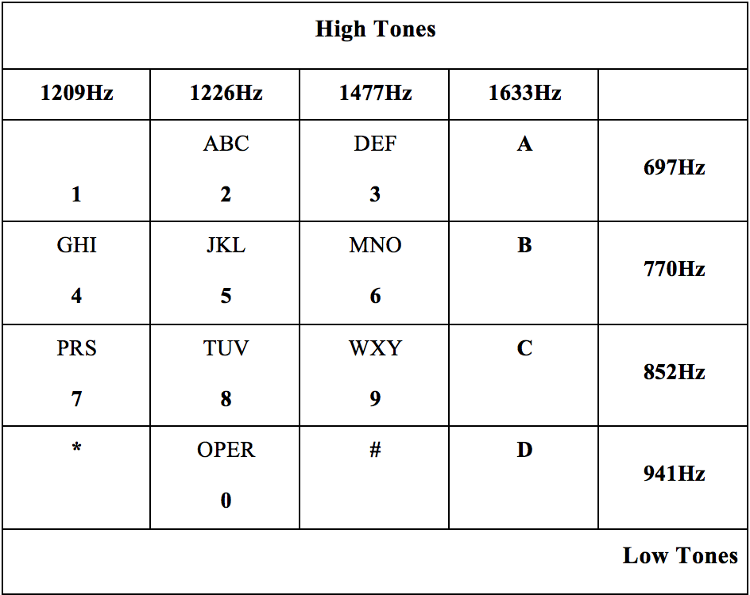

If two tones are present for each digit, then it eliminates the need for 24 tones for the twelve keys in the telephone (0-9,*, #). Earlier, tones were generated using coils and capacitors instead of IC’s that are employed today. So the idea of rows and columns were introduced.

=== A, B, C AND D TOUCH TONE KEYS

These are extensions to the standard touch-tones (0-9, *, #) which originated with the U.S. military's Autovon phone network. The original names of these keys were FO (Flash Override), F (Flash), I (Immediate), and P (Priority) which represented priority levels that could establish a phone connection with varying degrees of immediacy, killing other conversations on the network if necessary with FO being the greatest priority, down to P being of lesser priority. The tones are more commonly referred to as the A, B, C and D tones respectively, and all use a 1633 Hz as their high tone.

Nowadays, these keys/tones are mainly used in special applications such as amateur radio repeaters for their signaling or control. Modems   and touch tone circuits tend to include the A, B, C and D tones as well. These tones have not been used for general public service, and it would take years before these tones could be used in such things as customer information lines; such services would have to be compatible with the existing 12-button touch tone sets in any case.

==== DTMF IN TWO-WAY RADIOs
DTMF signals can be transmitted over the radio and turn things on/off, flash lights, control motors, cameras, warning systems excused over two-way radios by transmitting a DTMF phone number. The phone number is programmed in a decoder hooked up to a radio receiver at a remote location. When the decode sees the number coming in over the radio, it is activated and controls devices connected to it. Even wild cards can be used to confirm multiple locations with one DTMF signal. For example, let the DTMF codes be used for opening the overhead doors of a fire station. To remove all the overhead doors, information has to be sent for each door. This involves waste of time, instead a wild card can be used to open all the doors collectively.

===== ADVANTAGES OF DTMF TRANSMISSION
. The tones are not prone to interference during transmission.
. The tones are not affected by noise during transmission.
. Probability of error is less.
. These tones can be used for long distance communication

==== INTRODUCTION TO CMOS TECHNOLOGY
		
Digital Integrated circuits have been available for a good many years , and most are familiar with common logic family names such as TTL(transistor-transistor)logic and ECL(Emitter-coupled)logic, as well as those of older families such as RTL(resistor-transistor)logic and DTL(diode-transistor logic). Each of these families offers its own particular advantages when compared with other types, but all of them share a number of common disadvantages.

The most significant of these disadvantages are high quiescent current requirement (typically 5mA per gate, tight power supply requirements (supplies typically have to be regulated to within 10% of a specific value), low input impedance (typically a few hundred ohms per gate) and poor noise immunity (meaning that gates can be easily triggered by spikes on the input or supply lines.

In the early 1970’s a new and startlingly different type of digital IC appeared on the scene, and rapidly started to push all of the older families into obsolescence in low and medium speed applications. This new family of devices is known as COS/MOS or CMOS (Complementary-symmetry metal oxide semiconductor), and it suffers from none of the disadvantages of the earlier families.

Specifically, CMOS IC’s typically draw quiescent currents of a mere 0.01 µA per gate, can be operated from any supply within the range of 3-15 volts, have a typical input impedance of about a million mega ohms per gate (but are fully protected against static-charge damage via built-in safety circuitry), and have inherently excellent noise immunity that enable the IC’s to safely tolerate input spikes up to about 50% of the supply voltage without upset.

CMOS digital IC’s have excellent thermal characteristics, low-cost commercial types are designed to operate over the temperature range -40 0 C to -85 0 C, while the more expensive military versions can operate from -55 0 C to +125 0 C. CMOS digital IC’s are incredibly versatile devices.

==== CMOS TECHNOLOGY
The simplest type of circuit that can occur in any logical family is the inverter or NOT gate and this element forms the basics of virtually every other type of circuit element that is used in digital electronics.

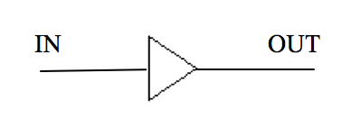

The operation of the circuit is quite simple. Inputs and outputs are always wither low (grounded or at logic-0) or high (at positive supply or logic-1). The RTL inverter has a fairly low impedance of about 500kand draws a quiescent current of either near-zero or 10mA. When driven by a low-frequency square wave, the circuit will draw a mean current of 5mA.

The basic circuit of a CMOS digital inverter or NOT gate comprises of nothing more than a P-channel and an N-channel enhancement-mode MOSFET (Metal-Oxide Semiconductor Field Effect Transistor) wired in series between the two supply lines, with the MOSFET gates tied together at the input terminal and with the output taken from the junction of the two devices.

The input (gate) terminal of an enhancement-mode MOSFET presents near-infinite impedance to DC voltages, and the magnitude of an extremely applied gate-to-source voltage controls the magnitude of drain-to-source current flow. When these MOSFET’s are used in the digital mode (with either logic-0 or logic-1) they can be regarded as voltage controlled switches.

The basic digital action of the N-channel device is such that its drain-to-source path acts like an open-circuit switch when the input is at logic-0 or as a closed switch in series with a 400 resistor when the input is at logic-1. The P-channel MOSFET has the inverse of these characteristics, and acts like a closed switch plus a 400 resistance with a logic-0 input, and as an open switch with a logic-1 input.

The circuit thus draws quiescent current but can ’source’ fairly large drive currents into an external output-to-ground load via the 400 output resistance of the inverter.

 
. Most TTL and CMOS logic systems are designated to operate from a single supply voltage rail of nominally +5V. With TTL devices, it is important for this voltage to be very closely regulated. Typical TTL specifications call for regulation of better than ±5% (i.e., the supply voltage should not fall outside the range 4.75V to 5.25V)

. When operating at reduced supply voltage (particularly with CMOS devices) it is important to note the propagation delay (i.e., the time taken for a change of state to appear at the output in response to a change at the input) will be significantly increased. In order to maintain high switching speeds, it is important to use a relatively high value of supply voltage.

. The absolute maximum supply voltage for TTL devices is normally 7V. If the supply voltage ever exceeds this, any TTL device connected to the supply rail are liable to self destruct very quickly.

. CMOS logic offers greater tolerance of supply rail variations and operates from a wider range of supply voltages (typically 3V to 15V) than TTL. Coupled with minimal current demand, this makes CMOS an obvious choice of logic family for use battery operated (portable) equipment.

. TTL devices require considerably more supply current than their CMOS equivalents. A typical TTL logic gate requires a supply current of around 8mA, approximately 1000 times that of its CMOS counterpart, when operating at a typical switching speed of 10 kHz.

. CMOS devices consume negligible power in the quiescent state. Power consumption for a CMOS device is, however, proportional to switching speed and, when this is excess of several megahertz, power consumption may approach (or even exceed) that of a comparable TTL device.

. When operating from supply voltages in excess of 5V or so, these are more immune to noise than their TTL counterparts. This makes CMOS the obvious choice for any application in which noise is to be a problem.

. All CMOS devices are now fitted with input static protection diodes but these should not be relied upon for protection and appropriate static precautions should be adopted when handling such devices.
⊗	Un-buffered CMOS devices exhibit smaller propagation delay but slightly lower noise margin than comparable buffered types.

. Unused TTL devices inputs should be pulled-up to logic 1 (Vcc) using 1k or 2.2 resistors. One resistor will provide a pull-up for up to 25 unused standard gate inputs. Unused CMOS inputs should be connected to drain or source voltages depending upon the logic function.

. Both CMOS and TTL logic require low-impedance supplies, which are adequately decoupled. Supply borne noise (due to transient spikes), can usually be eliminated by placing capacitors of 100nF and 10µF at strategic points distributed around a PCB layout. As a general rule, one disc or plate capacitor (of between 10nF and 100nF suitably rated) should be fitted for every two or four devices, whilst an electrolytic capacitor (of between 4.7µF and 47µF suitably rated) should be fitted for every eight to ten devices. Buffers (both inverting and non-inverting) and line-drivers will normally require additional (individual) coupling.

In our day-to-day life we come across many electronic devices and gadgets which are being controlled by remote controls. All these days from the advent of Radio frequency transmission we are still using the methods of remote-controlling which are primitive. Though the gadgets and devices have evolved through ages our controlling techniques has not fallen in the same pattern. Also the present day remote controls using RF face many drawbacks such as limited Controlling range, interference problems with other close by RF transmitters, Frequency tuning with other transmitters being difficult.

A new controlling technique is required which is cost effective and also which enables wide coverage. Communication technology is one of the fastest developing fields in modern electronics. Hence the possibility and the advantages of converting this widely developed technology into controlling equipment have many encouraging aspects. 

In today’s world security and surveillance has become a daily commodity. Hence the need for cost effective, easily controllable and less complex equipment is felt everywhere. A mechanical model driven by electronics (ROBOT) vehicle which is controlled by a device which has become a part of humans in the past decade, MOBILE PHONES has been the brain-child of this project. The purpose of the project is to achieve control of a robotic vehicle using Touch-tone dialing, thus using Mobile Phones as MOTION CONTROL DEVICES. The project concentrates on the utility of this application on the military and other surveillance needs. This controlling technique developed succeeds in efficiently wiping out the weakness in RF and other types of transmission and controlling techniques.

Its uniqueness lies in its simplicity of design and principle of operation. This circuitry employs rudimentary, low cost digital Integrated Circuits. Installation of this system is easy and it can be operated by anyone with no need for prior extensive knowledge. Its novelty lies in the fact that it is very cost effective though its utility exceeds the equipment of higher costs.

=== Chapter 2: BLOCK DIAGRAM

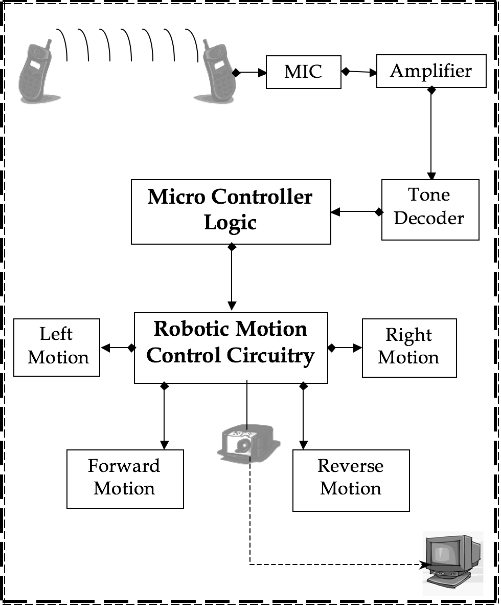

=== STEP-BY-STEP OPERATION

. A small robotic vehicle is built fitted with a mobile phone.
. A microphone is placed which acoustically detects the tones generated in the earphone of the mobile.
. An ordinary mobile phone is used as a remote control with pre-assigned keys.
. A call is made to the mobile on the robot and picked up manually.
. Any key pressed on the hand-held mobile will generate a complex frequency
. The vehicle can be controlled with the hand-held mobile
. The key tones generated are heard in the ear-piece of the vehicular mobile.
. The tones are then received by a microphone and amplified.
. Then the amplified signal tones are sent to the tone decoder circuit.
. The signal tones are decoded into their equivalent four bit data.
.  The Microcontroller interprets the four bit data in its input port, in accordance with its program and generates its output data.
. The microcontroller sends appropriate signals to the motor and steering drives (robotic motion controls) in accordance to the keys assigned.
. Thus the navigation of the robotic vehicle is performed.
. 0 can be used for self-destruction when used in military warfare.
. The micro controller is programmed for auto-surveillance and manual maneuvers, using the keys ‘*’ and ‘#’.
. A mini wireless camera can be placed in front of the vehicle, to transmit continuous video and/or audio.
. It is can be received by any small TV kept near the remote mobile to help in navigating the mobile when it is not within visible range.
. Keys assigned for control are

|====
| **1** | **3** | **2** | **8** | **4** | **6**
| START | STOP | FORWARD | REVERSE | LEFT | RIGHT
|====

=== Chapter 3: THE **CELL** APPROACH
One of the most interesting things about a cell phone is that it is actually a radio -- an extremely sophisticated radio. The telephone was invented by Alexander Graham Bell in 1876, and wireless communication can trace its roots to the invention of the radio by Nikolai Tesla in the 1880s (presented in 1894 by an Italian, named Guillermo Marconi). 

In the dark ages before cell phones, people who really needed mobile-communications ability installed radio telephones in their cars. In the radio-telephone system, there was one central antenna tower per city, and perhaps 25 channels available on that tower. This central antenna meant that the phone in a car needed a powerful transmitter -- big enough to transmit 40 or 50 miles (about 70 km). 

The genius of the cellular system is the division of a city into small cells. This allows extensive frequency reuse across a city, so that millions of people can use cell phones simultaneously. In a typical analog cell-phone, the cell-phone carrier receives about 800 frequencies to use across the city. The carrier chops the city into cells. Each cell is typically sized at about 10 square miles (26 square kilometers). Cells are normally thought of as a hexagon on a big hexagonal grid. Because cell phones and base stations use low-power transmitters, the same frequencies can be reused in non-adjacent cells.

Each cell has a base station that consists of a tower and a small building containing the radio equipment. A single cell in an analog system uses one-seventh of the available duplex voice channels. That is, each cell (of the seven on a hexagonal grid) is using one-seventh of the available channels so it has a unique set of frequencies and there are no collisions.

. A cell-phone carrier typically gets 832 radio frequencies to use in a city. 
. Each cell phone uses two frequencies per call -- a duplex channel -- so there are typically 395 voice channels per carrier. (The other 42 frequencies are used for control channels).
. Therefore, each cell has about 56 voice channels available. 
i.e., in any cell, 56 people can be talking on their cell phone at one time. With digital transmission methods, the number of available channels increases. 
  
Cell phones have low-power transmitters in them. Many cell phones have two signal strengths: 0.6 watts and 3 watts (for comparison, most CB radios transmit at 4 watts). The base station is also transmitting at low power. Low-power transmitters have two advantages:

. The transmissions of a base station and the phones within its cell do not make it very far outside that cell. Therefore both the cells can reuse the same 56 frequencies. The same frequencies can be reused extensively across the city. 
. The power consumption of the cell phone, which is normally battery-operated, is relatively low. Low power means small batteries, and this is what has made handheld cellular phones possible. 

The cellular approach requires a large number of base stations in a city of any size. A typical large city can have hundreds of towers. But because so many people are using cell phones, costs remain low per user. Each carrier in each city also runs one central office called the Mobile Telephone Switching Office (MTSO). This office handles all of the phone connections to the normal land-based phone system, and controls all of the base stations in the region.

CELL PHONE CODES
All cell phones have special codes associated with them. These codes are used to identify the phone, the phone's owner and the service provider
The following is the procedure that occurs when a call is placed to a mobile phone:

. When the phone is first is powered up, it listens for an SID on the control channel. The control channel is a special frequency that the phone and base station use to talk to one another about things like call set-up and channel changing. If the phone cannot find any control channels to listen to, it knows it is out of range and displays a "no service" message. 
. When it receives the SID, the phone compares it to the SID programmed into the phone. If the SIDs match, the phone knows that the cell it is communicating with is part of its home system. 
. Along with the SID, the phone also transmits a registration request, and the MTSO keeps track of your phone's location in a database -- this way, the MTSO knows which cell you are in when it wants to ring your phone. 
. The MTSO gets the call, and it tries to the mobile phone. It looks in its database to see which cell you are in. 
. The MTSO picks a frequency pair for the phone to take the call in that cell.
. The MTSO communicates with the mobile phone over the control channel to tell which frequencies to use, and once the mobile phone and the tower switch on those frequencies, the call is connected. 
. As the mobile phone moves toward the edge of the cell, the cell's base station notes that signal strength is diminishing. Meanwhile, the base station in the cell the mobile phone is moving towards (which is listening and measuring signal strength on all frequencies, not just its own one-seventh) sees the mobile phone's signal strength increasing. The two base stations coordinate with each other through the MTSO, and at some point, the phone gets a signal on a control channel telling it to change frequencies. This hand-off switches the mobile phone to the new cell. 

==== ROAMING
If the SID on the control channel does not match the SID programmed into your phone, then the phone knows it is roaming. The MTSO of the cell, in which the mobile is roaming, in turn contacts the MTSO of the home system, which then checks its database to confirm that the SID of the phone is valid. The home system verifies the phone to the local MTSO, which then tracks the phone as it move through its cells.

====  CELL PHONES AND CBS
The sophistication of a cell phone can be understood by comparing it to a CB radio or a walkie-talkie. 

. FULL-DUPLEX VS. HALF-DUPLEX - Both walkie-talkies and CB radios are half-duplex devices. That is, two people communicating on a CB radio use the same frequency, so only one person can talk at a time. A cell phone is a full-duplex device. That means that the mobile phone uses one frequency for talking and a second, separate frequency for listening. Both people on the call can talk at once. 
. CHANNELS - A walkie-talkie typically has one channel, and a CB radio has 40 channels. A typical cell phone can communicate on 1,664 channels.
. RANGE - A walkie-talkie can transmit about 1 mile (1.6 km) using a 0.25-watt transmitter. A CB radio, because it has much higher power, can transmit about 5 miles (8 km) using a 5-watt transmitter. Cell phones operate within cells, and they can switch cells as they move around. Cells give cell phones incredible range. Someone using a cell phone can drive hundreds of miles and maintain a conversation the entire time because of the cellular approach. 

==== INSIDE A CELL PHONE
On a **complexity per cubic inch** scale, cell phones are some of the most intricate devices people play with on a daily basis. Modern digital cell phones can process millions of calculations per second in order to compress and decompress the voice stream.
It contains the following individual parts:

. An amazing circuit board containing the brains of the phone 
. An antenna 
. A liquid crystal display (LCD) 
. A keyboard (not unlike the one you find in a TV remote control) 
. A microphone, a speaker and a battery

==== ON THE CIRCUIT BOARD
The circuit board is the heart of the system. Here is a typical Nokia digital phone: 

====== FRONT SIDE VIEW                       
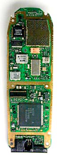

====== BACK SIDE VIEW
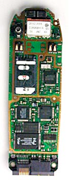

The analog-to-digital and digital-to-analog conversion chips translate the outgoing audio signal from analog to digital and the incoming signal from digital back to analog. The digital signal processor (DSP) is a highly customized processor designed to perform signal-manipulation calculations at high speed.

===== THE MICROPROCESSOR 
The Microprocessor handles the keyboard and display, deals with command and control signaling with the base station and also coordinates the rest of the functions on the board. The ROM and Flash memory chips provide storage for the phone's operating system and customizable features, such as the phone directory. The radio frequency (RF) and power section handles power management and recharging, and also deals with the hundreds of FM channels. Finally, the RF amplifiers handle signals traveling to and from the antenna.

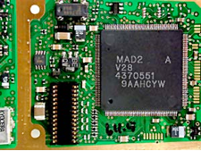

====== FLASH MEMORY CHIPS
Some phones store certain information, such as the SID and MIN codes, in internal Flash memory, while others use external cards that are similar to Smart Media cards. 

**WITH FLASH MEMORY CARD**

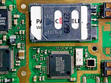

**FLASH MEMORY CARD REMOVED**

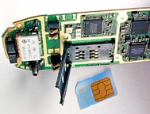

====== DISPLAY AND KEYPAD CONTACTS
The display has grown considerably in size as the number of features in cell phones has increased. Most current phones offer built-in phone directories, calculators and even games. And many of the phones incorporate some type of PDA or Web browser. 

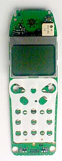

====== CELL-PHONE SPEAKER, MICROPHONE AND BATTERY BACKUP

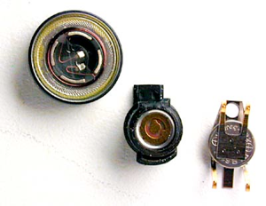

===== ALONG COMES DIGITAL
Digital cell phones use the same radio technology as analog phones, but they use it in a different way. Analog systems do not fully utilize the signal between the phone and the cellular network -- analog signals cannot be compressed and manipulated as easily as a true digital signal. Digital phones convert your voice into binary information (1s and 0s) and then compress it. This compression allows between three and 10 digital cell-phone calls to occupy the space of a single analog call. 

Many digital cellular systems rely on frequency-shift keying (FSK) to send data back and forth over AMPS. FSK uses two frequencies, one for 1s and the other for 0s, alternating rapidly between the two to send digital information between the cell tower and the phone. Clever modulation and encoding schemes are required to convert the analog information to digital, compress it and convert it back again while maintaining an acceptable level of voice quality.

===== CELLULAR ACCESS TECHNOLOGIES
These are the common technologies used by cell-phones for transmitting information: 

. Frequency division multiple access (FDMA) 
. Time division multiple access (TDMA) 
. Code division multiple access (CDMA) 

The first word tells you what the access method is. The second word, division, lets you know that it splits calls based on that access method and multiple access means multi-user for each cell.

. FDMA puts each call on a separate frequency. 
. TDMA assigns each call a certain portion of time on a designated frequency. 
. CDMA gives a unique code to each call and spreads it over the available frequencies. 

====== CELLULAR ACCESS TECHNOLOGIES: FDMA
FDMA separates the spectrum into distinct voice channels by splitting it into uniform chunks of bandwidth. Each station sends its signal at a different frequency within the available band. FDMA is used mainly for analog transmission.

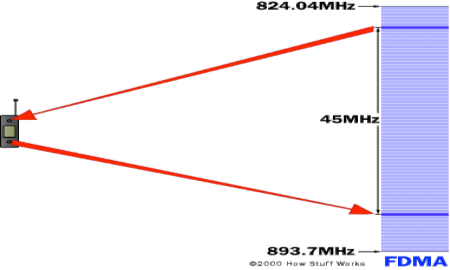

===== CELLULAR ACCESS TECHNOLOGIES: TDMA
TDMA is the access method used by the Electronics Industry Alliance and the Telecommunications Industry Association for Interim Standard 54 (IS-54) and Interim Standard 136 (IS-136). Using TDMA, a narrow band that is 30 kHz wide and 6.7 milliseconds long is split time-wise into three time slots. 

Narrow band means **channels** in the traditional sense. Each conversation gets the radio for one-third of the time. This is possible because voice data that has been converted to digital information is compressed so that it takes up significantly less transmission space. Therefore, TDMA has three times the capacity of an analog system using the same number of channels. TDMA systems operate in either the 800-MHz (IS-54) or 1900-MHz (IS-136) frequency bands.

**TDMA SPLITS A FREQUENCY INTO TIME SLOTS**

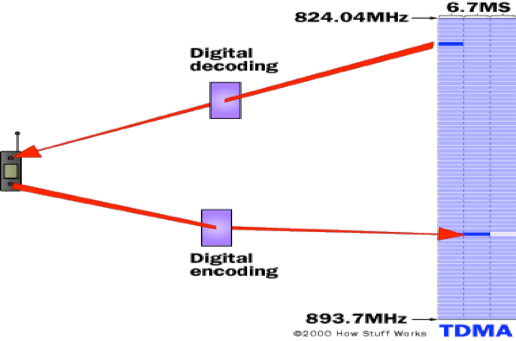

==== CELLULAR ACCESS TECHNOLOGIES: CDMA
CDMA takes an entirely different approach from TDMA. CDMA, after digitizing data, spreads it out over the entire available bandwidth. Multiple calls are overlaid on each other on the channel, with each assigned a unique sequence code. CDMA is a form of spread spectrum, which simply means that data is sent in small pieces over a number of the discrete frequencies available for use at any time in the specified range.

**IN CDMA, EACH PHONE'S DATA HAS A UNIQUE CODE**

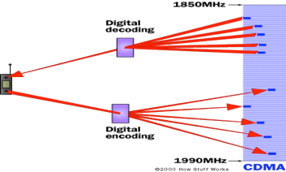

All of the users transmit in the same wide-band chunk of spectrum. Each user's signal is spread over the entire bandwidth by a unique spreading code. At the receiver, that same unique code is used to recover the signal. Because CDMA systems need to put an accurate time-stamp on each piece of a signal, it references the GPS system for this information. Between eight and 10 separate calls can be carried in the same channel space as one analog AMPS call. CDMA technology is the basis for Interim Standard 95 (IS-95) and operates in both the 800-MHz and 1900-MHz frequency bands. 

== INTRODUCTION
Sound is an amazing thing. All of the different sounds that we hear are caused by minute pressure differences in the air around us. The amazing fact about it is that the air transmits those pressure changes so well, and so accurately, over relatively long distances. 

The first microphone was a metal diaphragm attached to a needle, and this needle scratched a pattern onto a piece of metal foil. The pressure differences in the air that occurred when you spoke toward the diaphragm moved the diaphragm, which moved the needle, which was recorded on the foil. When you later ran the needle back over the foil, the vibrations scratched on the foil would then move the diaphragm and recreate the sound.

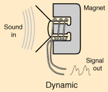

All modern microphones are trying to accomplish the same thing as the original, but do it electronically rather than mechanically. A microphone wants to take varying pressure waves in the air and convert them into varying electrical signals. There are five different technologies commonly used to accomplish this conversion:

. **CARBON MICROPHONES** - The oldest and simplest microphone uses carbon dust. This is the technology used in the first telephones and is still used in some telephones today. The carbon dust has a thin metal or plastic diaphragm on one side. As sound waves hit the diaphragm, they compress the carbon dust, which changes its resistance. By running a current through the carbon, the changing resistance changes the amount of current that flows. 
. **DYNAMIC MICROPHONES** - A dynamic microphone takes advantage of electromagnet effects. When a magnet moves past a wire (or coil of wire), the magnet induces current to flow in the wire. In a dynamic microphone, the diaphragm moves either a magnet or a coil when sound waves hit the diaphragm, and the movement creates a small current. 
. **RIBBON MICROPHONES** - In a ribbon microphone, a thin ribbon is suspended in a magnetic field. Sound waves move the ribbon which changes the current flowing through it.
. **CONDENSER MICROPHONES** - A condenser microphone is essentially a capacitor, with one plate of the capacitor moving in response to sound waves. The movement changes the capacitance of the capacitor, and these changes are amplified to create a measurable signal. Condenser microphones usually need a small battery to provide a voltage across the capacitor.
. **CRYSTAL MICROPHONES** - Certain crystals change their electrical properties as they change shape. By attaching a diaphragm to a crystal, the crystal will create a signal when sound waves hit the diaphragm.

The one thing they all have in common is the diaphragm, which collects the sound waves and creates movement in whatever technology is being used to create the signal.

=== HOW MICROPHONES WORK

Microphones just convert a real sound wave into an electrical audio signal. In order to do so, they have a small, light material in them called the diaphragm. When the sound vibrations through the air reach the diaphragm, they cause the diaphragm to vibrate. This in turns will somehow cause an electrical current in the microphone to vary, whereupon it is sent out to a mixer, preamplifier or amplifier for use. Microphones are typically classified according to how the diaphragms produce sound. 

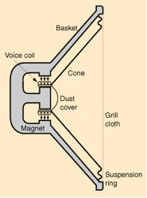

==== DYNAMIC MICROPHONES
Dynamic microphones typically use moving-coil technology. This consists of a diaphragm of usually thin plastic being attached directly to a dense coil of wire. The coil has a magnet either surrounding it or at the centre. As the diaphragm vibrates, the coil vibrates, and its changing position relative to the magnet causes a varying current to flow through the coil. This current is your audio signal.

Dynamic microphones have hardy diaphragms, but are typically damaged when the suspension wires break, due to dropping or rough handling. These are the little things that hold the coil and diaphragm in a floating position relative to the magnets.

Dynamic microphones have to cause a whole coil of wires to move, a mountain when you're talking about little movements of air. This makes them not as sensitive as higher-grade microphones, especially to very soft sounds or high-pitched sounds, such as sibilants in speech or harmonics in music. They have a reputation of being very hardy, and some higher grade dynamic microphones can give a very clean and sensitive sound. Dynamic microphones are also known to give a **fat** sound, which is flattering to those frequencies that the human ear can hear. They are usually not expected to reproduce the sounds they pick up very faithfully.

==== CONDENSER MICROPHONES
The technology for condenser microphones has improved greatly in recent years, bringing costs down, increasing its hardiness, and making them even better. In condenser microphones, a static charge is impressed on the diaphragm or on a back-plate to the diaphragm. As the diaphragm vibrates, the distance from the back-plate to the diaphragm vibrates, altering the capacitance of the diaphragm and the back-plate. This fluctuating capacitance results in a fluctuating electric current.

Instead of moving a whole coil of wires, condenser microphones only have a thin diaphragm and solid back-plate making up a capacitor. Condenser microphones are therefore sometimes known as capacitor microphones.

==== CARBON GRANULE MICROPHONES
These are the microphones found in many older telephones. They consist of a heavy diaphragm placed within a 'bath' of minuscule carbon granules, sealed to prevent the granules from falling out. As in graphite cables, the carbon is used to conduct electricity. The vibration of the diaphragm alters the resistance of current passing through the microphone, creating an audio signal. Note that this type of microphone requires an electrical current to pass through its circuitry, while dynamic microphones create their own current. Condenser microphones sometimes have batteries within them, so they might be considered as being able to create their own current.

==== WIRELESS MICROPHONES
These microphones are essentially the same as ordinary microphones with a transmitter. The transmitter can be in the body of a handheld microphone (which accounts for the larger size of a wireless. Wireless microphones typically transmit on only one unique frequency per microphone. A 'true diversity' wireless system will have two antennae on the receiver end (which, incidentally, usually puts out a line-level signal for the mixer instead of a microphone signal). When the signal strength between the two antennae varies, the receiver will opt to receive the signal from the stronger antennae. This switching can be very rapid and is usually unnoticeable. True diversity wireless systems are usually far less sensitive to radio interference and blockage than single-antennae systems.

==== LAVALIERE MICROPHONES
The familiar 'interviewer's collar pin', which consists of a small, usually electrets microphone worn at the chest, clipped to clothing. This can either be corded or wireless, though the latter is usually preferred. The wireless version runs into a transmitter, usually worn on the belt. Lavaliere microphones can be powered by batteries or phantom power, depending on the make of the microphone. 

==== Amplification Basics  
The term **amplifier** has become generic, and is often thought to mean a power amplifier for driving loudspeakers. The term "amplify" basically means to make stronger. The strength of a signal (in terms of voltage) is referred to as amplitude. The two major types of amplification, and a third "derived" type:

. Voltage Amplifier - an amp that boosts the voltage of an input signal 
. Current Amplifier - an amp that boosts the current of a signal 
. Power Amplifier - the combination of the above two amplifiers

In the case of a voltage amplifier, a small input voltage will be increased, so that for example a 10mV (0.01V) input signal might be amplified so that the output is 1 Volt. This represents a "gain" of 100 - the output voltage is 100 times as great as the input voltage. This is called the voltage gain of the amplifier.

In the case of a current amplifier, an input current of 10mA (0.01A) might be amplified to give an output of 1A. Again, this is a gain of 100, and is the current gain of the amplifier. The power gain is therefore 10,000, which is the voltage gain multiplied by the current gain. In reality all amplifiers are power amplifiers, since a voltage cannot exist without power unless the impedance is infinite.

==== Input Impedance 
Amplifiers will be quoted as having specific input impedance. The load is that resistance or impedance placed on the output of an amplifier. In the case of a power amplifier, the load is most commonly a loudspeaker. Any load will require that the source (the preceding amplifier) is capable of providing it with sufficient voltage and current to be able to perform its task. In the case of a speaker, the power amplifier must be capable of providing a voltage and current sufficient to cause the speaker cone(s) to move. This movement is converted to sound by the speaker.

==== Output Impedance
The output impedance of an amplifier is a measure of the impedance or resistance "looking" back into the amplifier. It has nothing to do with the actual loading that may be placed at the output.

==== Feedback
Feedback in its broadest sense means that a certain amount of the output signal is "fed back" into the input. An amplifier - or an element of an amplifying device - is presented with the input signal, and compares it to a "small scale replica" of the output signal. If there is any difference, the amp corrects this, and ideally ensures that the output is an exact replica of the input, but with greater amplitude. Feedback may be as a voltage or current, and has a similar effect in either case.

In many designs, one part of the complete amplifier circuit (usually the input stage) acts as an error amplifier, and supplies exactly the right amount of signal to the rest of the amp to ensure that there is no difference between the input and output signals, other than amplitude.

==== Signal Inversion
When used as voltage amplifiers, all the standard active devices invert the signal. This means that if a positive signal goes in, it emerges as a larger - but now negative - signal.

==== Types of Amplifier Devices
A perfect amplifier or other device will perform its task within certain set limits, without adding or subtracting anything from the original signal. No ideal amplifying device exists, and as a result, no ideal amplifier exists, since all must be built with real-life (non-ideal) devices. 

The amplifying devices currently available are: 

. Vacuum Tube (Valve) 
. Bipolar Junction Transistor (BJT) 
. Field Effect Transistor (FET)

All of these devices are reliant on other non-amplifying ("support") components, commonly known as passive components. The passive devices are resistors, capacitors and inductors, and without these, we would be unable to build amplifiers at all. All the devices we use for amplification have a variable current output, and it is only the way that they are used that allows us to create a voltage amplifier. Valves and FETs are voltage controlled devices, meaning that the output current is determined by a voltage, and no current is drawn from the signal source. Bipolar transistors are current controlled, so the output current is determined by the input current.

==== Common Limiting Ratings 
All active devices have certain parameters in common. Essentially these are:

. Maximum Voltage - The maximum voltage that may be applied between the main terminals of the device. This varies from perhaps as low as 25V for small signal transistors and FETS, and up to 1,200V or more for some valves and high voltage transistors
. Maximum Current - The maximum current that the device may pass safely. Ranges from a few mA up to many amps. 
. Maximum Power Dissipation - The maximum power that the device may dissipate (in mW or W), under any condition of voltage and current. 
. Heater Voltage/Current - (Valves).  The operating voltage and / or current for the filament (directly heated cathodes) or heater (for indirectly heated cathodes). This should always be within 10% of the quoted value, or cathode life will be severely shortened. 
. Maximum Junction Temperature - (Semiconductors)  The maximum temperature that the semiconductor die will tolerate without failing. At this temperature, most semiconductors will be unable to perform any work, as this would raise the temperature above the maximum permissible. 
. Temperature Derating - (Semiconductors).  Above a specified temperature, the allowable power rating of semiconductor devices must be reduced to remain below the maximum allowable junction temperature. The power is normally derated above 25 degrees C. 
. Thermal Resistance - (Semiconductors).  The thermal resistance between junction and case (high power) or junction and air (low power). Measured in Degrees C/W, This allows a suitable heat-sink to be determined.

With most semiconductors, it is not possible to operate them at anywhere near the maximum power dissipation, because thermal resistance is such that the heat simply cannot be removed from the junction and into the heat-sink fast enough. In these cases, it might be necessary to use multiple devices to achieve the performance that can be obtained from a single component. This is very common in audio amplifiers.

=== Operational Amplifiers (Op-amps) 
The operational amplifier was originally used for analogue computers, although at that time they were made using discrete components. Modern (good) op-amps are so good, that it is difficult or impossible to achieve results even close with discrete transistors or FETs. However, there are still some instances where op-amps are just not suitable, such as when high supply voltages are needed for large voltage swings.

An operational amplifier or op-amp is an electronic circuit module (normally built as an integrated circuit, but occasionally with discrete transistors or vacuum tubes) which has a non-inverting input (+), an inverting input (-) and one output. The output voltage is the difference between the + and - inputs multiplied by the open-loop gain: 

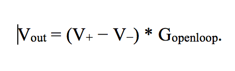

Since op-amps have uniform parameters and often standardized packaging as well as standard power supply needs, they help in designing an application fast.

Originally, op-amps were so named because they were used to model the basic mathematical operations (add, subtract, integrate, differentiate etc) in electronic analog computers. In this sense a true operational amplifier is an ideal circuit element. The real ones we use, made of transistors, tubes etc, are approximations to this ideal. The ideal op-amp has an infinite open-loop gain, infinite bandwidth, infinite input impedances, zero output impedance and zero noise, as well as zero input offset (0.0V out when both inputs are exactly equal) and no thermal drift. Modern integrated circuit MOSFET op-amps approximate closer and closer to these ideals in limited-bandwidth, large-signal applications at room temperature.

==== Notation
A typical circuit symbol for an op-amp looks like this:

source: https://upload.wikimedia.org/wikipedia/commons/5/56/Opamppinouts.png

Its terminals are:

. V~+~: non-inverting input 
. V~−~: inverting input 
. V~out~: output 
. V~S+~: positive power supply 
. V~S−~: negative power supply 

The power supply pins (V~S+~ and V~S-~) can be labeled many different ways. For FET based op-amps, the positive, common drain supply is labeled V~DD~ and the negative, common source supply is labeled V~SS~. For BJT based op-amps, the V~S+~ pin becomes V~CC~ and V~S−~ becomes V~EE~. They are also sometimes labeled V~CC+~ and V~CC−~, or even V~+~ and V~−~, in which case the inputs would be labeled differently.

If the positive input is most positive, then the output will swing to the positive supply rail (or as close as it can get). Should the negative input be more positive, and then the output will swing to the negative supply rail. The difference between the two inputs may be less than 1mV.

Modern op-amps is the nearest one to the ideal amplifier. The bandwidth is very wide indeed, with very low distortion, and low noise. Although it is quite possible to obtain an output impedance of far less than 10 Ohms, the current output is usually limited to about +/-20mA or so. Supply voltage of most op-amps is limited to a maximum of about +/-18V, although there are some that will take more, and others less. Depending on the opamp used, gains of 100 with a frequency response up to 100kHz are easily achieved, with noise levels being only very marginally worse that a dedicated discrete design using all the noise reducing tricks known. The circuits shown below have frequency response down to DC, with the upper frequency limit determined by device type and gain. 

**Figure 3.1 - Standard Opamp Configurations**

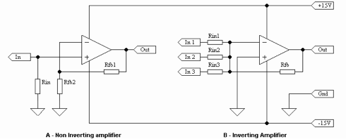

Figure 3.1 shows the two most common opamp amplifier circuits. The first (4.1a) is non-inverting, and is the better connection for minimum noise. The voltage fed back through Rfb1 will cause a voltage to be developed across Rfb2. The output will correct itself until these two voltages are equal at any instant in time. It does not matter if the signal is a sine wave, square wave, or music, the opamp will keep.

Once the speed of the opamp is not significantly higher than the rate of change of the input (generally a factor of 10 is sufficient - i.e. the opamp needs to be 10 times faster than the highest frequency signal it is expected to amplify), the output will become distorted. At voltage gains of 10 or less, almost any opamp will be able to keep up with typical audio signals.

Input impedance is equal to Rin and voltage gain (Av) is calculated from:

**Av = (Rfb1 + Rfb2) / Rfb2**

The second circuit (4.1b) is an inverting amplifier, and is commonly used as a "summing" amplifier - the output is the negative sum of the three (or more) inputs. If the positive input is earthed (grounded), then the opamp must try to keep the -ve input at the same voltage - namely 0V.

Input impedance is equal to RinX (where X is the number of the input), and voltage gain is calculated from

**Av = Rfb / RinX**

Multiple inputs can all have different gains (and input impedances). If the source does not have output impedance significantly lower than Rin, then the gain will be lower than expected. If the circuit is configured for a gain of 1 (actually it is technically correct to refer to it as -1), Rin1, Rin2 etc. will all be equal to Rfb.

==== Power Op-amps 
Op-amps even come in power versions, using a TO-220 (or other specialized) case, and are typically capable of around 25W into an 8 Ohm speaker load. These devices, while not exactly to audiophile standards, are still very capable, and have been used by many domestic appliance manufacturers in such things as high-end TV sets and standard hi-fi equipment. Some of the more advanced devices are capable of output power up to 80W. 

== Low Power Dual Operational Amplifiers

=== General Description
The LM158 series consists of two independent, high gain, internally frequency compensated operational amplifiers which were designed specifically to operate from a single power supply over a wide range of voltages. Operation from split power supplies is also possible and the low power supply current drain is independent of the magnitude of the power supply voltage. 

Application areas include transducer amplifiers, dc gain blocks and all the conventional op amp circuits which now can be more easily implemented in single power supply systems. For example, the LM158 series can be directly operated off of the standard +5V power supply voltage which is used in digital systems and will easily provide the required interface electronics without requiring the additional ±15V power supplies. The LM358 and LM2904 are available in a chip sized package (8-Bump micro SMD) using National’s micro SMD package technology.

=== Unique Characteristics
In the linear mode the input common-mode voltage range includes ground and the output voltage can also swing to ground, even though operated from only a single power supply voltage. The unity gain cross frequency is temperature compensated. The input bias current is also temperature compensated.

=== Advantages
. Two internally compensated op amps
. Eliminates need for dual supplies
. Allows direct sensing near GND and VOUT also goes to GND
. Compatible with all forms of logic
. Power drain suitable for battery operation
. Pin-out same as LM1558/LM1458 dual op amp

=== Features
. Available in 8-Bump micro SMD chip sized package,
. Internally frequency compensated for unity gain
. Large dc voltage gain: 100 dB
. Wide bandwidth (unity gain): 1 MHz (temperature compensated)
. Wide power supply range:
. Single supply: 3V to 32V or dual supplies: ±1.5V to ±16V
. Very low supply current drain (500 µA) independent of supply voltage
. Low input offset voltage: 2 mV
. Input common-mode voltage range includes ground
. Differential input voltage range equal to the power supply voltage
. Large output voltage swing: 0V to V+− 1.5V

=== VOLTAGE CONTROLLED OSCILLATOR

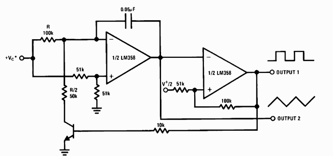

==== PIN DIAGRAMS

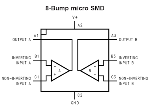

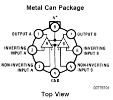

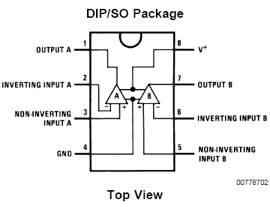

==== PRINCIPLE OF TONE GENERATION

|====
| **1** | 697+1209 | **9** | 852+1477
| **2** | 697+1336 | **0** | 941+1336
| **3** | 697+1477 | ***** | 941+1209
| **4** | 770+1209 | **#** | 941+1477
| **5** | 770+1336 | **A** | 697+1633
| **6** | 770+1477 | **B** | 770+1633
| **7** | 852+1209 | **C** | 852+1633
| **8** | 852+1336 | **D** | 941+1633
|====

There is **no base band multiplexing** done on DTMF signals. The signal generated by a DTMF encoder is a direct algebraic summation, in real time, of the amplitudes of two sine (cosine) waves of different frequencies. When the 4 button is pressed, the 770 Hz and 1209 Hz tones are sent together. The telephone central office will then decode the number from this pair of tones. The tone frequencies were designed to avoid harmonics and other problems that could arise when two tones are sent and received<o:p></o:p>

They may sound rather musical when dialed (and representations of many popular tunes are possible), but they are not intended to be so. The tones should all be +/- 1.5% of nominal. The high frequency tone should be at least as loud, and preferably louder than the low frequency. It may be as much as 4 db louder. This factor is referred to as twist." If a Touchtone signal has +3db of twist, then the high frequency is 3 db louder than the low frequency. Negative twist is when the low frequency is louder.

=== 8870 – DTMF RECEIVERS

===== CHARACTERISTIC FEATURES
. Complete DTMF receiver
. Low power consumption
. Internal gain setting amplifier
. Adjustable guard time
. Central office quality
. Power down mode
. Inhibit mode
. Backward compatible with 8870C/8870C-1

==== PIN DIAGRAM - IC 8870

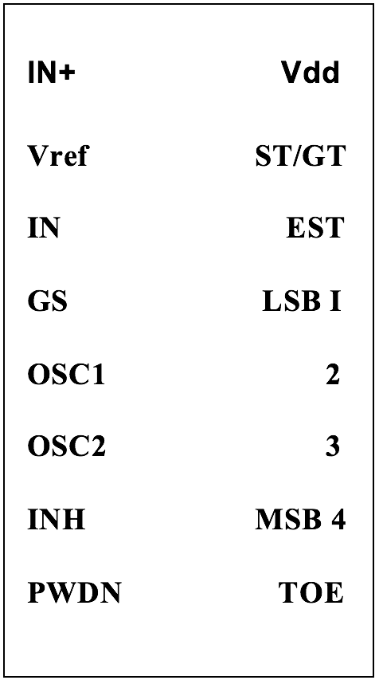

===== PIN DESCRIPTION

|====
| **  IN+** | Non-inverting op amp (input)
| ** IN-** | Inverting op amp (input)
| **GS** | Gain Select. Gives access to output of front end differential amplifier for connection of feed back resistor.
| **V~ref~** | Reference voltage (output). Normally Vdd/2 is used to bias inputs at midrail.
| **INH** | Inhibit (input). Logic high inhibits the detection of tones representing characters A, B, C, D. This pin input is internally pulled down.
| **OSC1** | Clock (input)
| **OSC2** | Clock (output)
| **V~ss~** | Ground (input)
| **TOE** | Three state Output Enable (input). Logic high enables the outputs Q1-Q4. This pin is pulled up internally
| **Q1-Q4** | Three state output enable (input). When enabled by toe, provide the code corresponding to the last valid one pair received. When TOE is logic low, the data outputs are high impedance.      
| **Std** | Delayed steering (output). Presents logic high when a received tone pair has been registered and the output latch updated; returns to a logic low, the data outputs are high impedance.
| **Est** | Early steering (output). Presents logic high, once the digital algorithm has detected a valid tone pair. Any momentary loss of signal will cause Est to return to a logic low
| **St/Gt** | Steering Input/Guard time (Output) Bi-directional. A Voltage greater than Vt is detected at St causes the device to register the detected tone pair and update the output latch
| **V~dd~** | Positive power supply.
| **NC** | No connection.
|====

=== STRUCTURAL DESCRIPTION
The 8870D/8870D-1 is a complete DTMF receiver integrating both the band split filter and digital decoder functions. The filter section uses switched capacitor techniques for high and low group filters; the decoder uses digital counting techniques to detect and decode all 16 DTMF tone pairs into a 14 bit code. External component count is minimized by on chip provision of a differential input amplifier, clock oscillator and latched three state bus interfaces.

=== FUNCTIONAL DESCRIPTION
The MT8870D/8870D-1 monolithic receiver offer small size, low power consumption and high performance. Its architecture consists of a band split filter section, which separates the high low group tones, followed by a digital counting section which verifies the frequency and duration of the received tones before passing the corresponding code to the output bus.

===FILTER SECTION
Separation of the low and high group tones is achieved by applying the DTMF signal to the inputs of the sixth order switched capacitor band pass filter, the bandwidths of which correspond to the low and high frequencies. The filter section also incorporates notches at 350 and 440 Hz for exceptional dial tone rejection. Each filter output is followed by a single order switched capacitor filter, which smoothens the signals prior to limiting. The outputs of comparators provide full rail logic swings at different frequencies of the incoming DTMF signals.

=== DECODER SECTION
Following the filter section is a decoder employing digital counting techniques to determine the frequencies of the incoming tones and to verify that they correspond to standard DTMF frequencies. A complex averaging algorithm protects against tone stimulation by extraneous signals such as voice while providing tolerance to small frequency deviations and variations. This averaging algorithm has been developed to ensure an optimum combination of immunity to talk off and tolerance to the presence of interfering frequencies and noise. When the detector recognizes the presence of two valid tones the early steering output will go to an active state. Any subsequent loss of signal condition will cause Est to assume an inactive state.

==== STEERING CIRCUIT
Before registration of a decoded pair, the receiver checks for valid signal duration. This check is performed by an external RC time constant driven by E~st~. A logic high figure on E~st~ causes V~c~ to rise as the capacitor discharges. Provided signal condition is maintained for the validation period V~c~ reaches the threshold of the steering logic to register the tone pair, latching its corresponding 4-bit code into the output latch. At this point the GT output is activated and drives V~c~ to V~dd~. GT continues to drive as long as E~st~ remains high. 

Finally, after a short delay to allow the output latch to settle the delayed steering output flag Std goes high, signaling that a received tone pair has been registered. The contents of the output latch are made available on the 4-bit output bus by raising the three state control input to logic high. The steering circuit works in reverse to validate the inter digit pause between the signals. Thus as well as rejecting signals too short to be considered valid, the receiver will tolerate signal interruptions too short to be considered as a valid pause. This facility together with the capability of selecting the steering time constants externally allows the designer to meet a wide variety of system requirements.

==== GUARD TIME ADJUSTMENT
Components are chosen according to the formula

**Trec = Tdp + Tgtp**

**Tid = Tda + Tgta**

The value of Tdp is a device parameter and Trec is the minimum signal duration to be recognized by the receiver. A value for C=0.1 is recommended for most applications, leaving R to be selected by the designer.
POWER DOWN AND INHIBIT MODE
	Logic high applied to ‘pin 6’ will power down the device to minimize the power consumption in a standby mode. It stops the oscillator and the functions of the filter. Inhibit mode is enabled by a logic high input to the pin 5(INH). It inhibits the detection of tones representing characters A, B, C, D. The output will remain the same as the previous detected code.
DIFFERENTIAL INPUT CONFIGURATION
	The input arrangement provides a differential input operational amplifier as well as bias source (Vref) which is used to bias the inputs at mid-rail. Provision is made for connection of feedback resistor to op-amp output for adjustment of gain. In single ended configuration, the input pins are connected with the op-amps for unity gain.
CRYSTAL OSCILLATOR
	The internal clock circuit is with 3.579545 MHz crystal. It provides a time base for the circuit. The DTMF tones must be valid for a particular duration to be received by the DTMF receiver and decode it and convert it to its equivalent BCD output.
APPLICATIONS
. Receiver system for British telecom
. Repeater systems/Mobile radio
. Credit card systems
. Remote control
. Personal computers
. Telephone answering machine

We have known that a computer system consists of three main components, the Central Processing Unit (CPU), the Memory and the Input/Output interface. Also we have the clock and the reset circuit. The miniaturization of the CPU onto a single chip is known as microprocessor. Further miniaturization leads to the integration of the RAM, the ROM and the I/O interface with the CPU, on a single silicon chip. These microcomputers on a single chip are known as MICROCONTROLLERS. 

The evolution of microprocessor technology launched of into developing more powerful microprocessors of increasing word lengths and into the integration of memory and I/O interface with the CPU, on a single chip and providing more and more I/O facilities on it.

This developed because of the need of fast real time control requiring the integration of the CPU, the memory and the I/O facilities on a single chip. More and more I/O facilities are being provided in microcontrollers such as D/A and A/D. The compactness of these microcontrollers has made it possible to provide automation to small and low cost systems and even toys. More powerful microcontrollers are available for sophisticated control applications.

AT89S8252 microcontroller is one of the latest products of ATMEL with many characteristic features.

==== DESCRIPTION
The AT89S8252 is a low-power, high-performance CMOS 8-bit microcomputer with 8K bytes of downloadable Flash programmable and erasable read only memory and
2K bytes of EEPROM. The device is manufactured using AT Mel’s high-density nonvolatile memory technology and is compatible with the industry-standard 80C51 instruction set and pin-out. The on-chip downloadable Flash allows the program memory to be reprogrammed in-system through an SPI serial interface or by a conventional nonvolatile memory programmer. By combining a versatile 8-bit CPU with downloadable Flash on a monolithic chip, the ATMEL AT89S8252 is a powerful microcomputer which provides a highly-flexible and cost-effective solution to many embedded control applications. 

In addition, the AT89S8252 is designed with static logic for operation down to zero frequency and supports two software selectable power saving modes. The Idle Mode stops the CPU while allowing the RAM, timer/counters, serial port, and interrupt system to continue functioning. The Power-down mode saves the RAM contents but freezes the oscillator, disabling all other chip functions until the next interrupt or hardware reset.

The downloadable Flash can be changed a single byte at a time and is accessible through the SPI serial interface. Holding RESET active forces the SPI bus into a serial programming interface and allows the program memory to be written to or read from unless Lock Bit 2 has been activated.

==== FEATURES
. Compatible with MCS-51^TM^ Products
. 8K Bytes of In-System Reprogrammable Downloadable Flash Memory
. SPI Serial Interface for Program Downloading
. Endurance: 1,000 Write/Erase Cycles
. 2K Bytes EEPROM
. Endurance: 100,000 Write/Erase Cycles
. 4V to 6V Operating Range
. Fully Static Operation: 0 Hz to 24 MHz
. Three-level Program Memory Lock
. 256 x 8-bit Internal RAM
. 32 Programmable I/O Lines
. Three 16-bit Timer/Counters
. Nine Interrupt Sources
. Programmable UART Serial Channel
. Low-power Idle and Power-down Modes
. Interrupt Recovery From Power-down
. Programmable Watchdog Timer
. Dual Data Pointer and Power-off Flag

===== PIN DIAGRAM

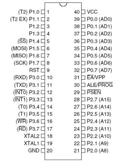

==== Pin Description

. **VCC - Supply voltage.**
. **GND - Ground.**

==== Port 0
Port 0 is an 8-bit open drain bi-directional I/O port. As an output port, each pin can sink eight TTL inputs. When 1s are written to port 0 pins, the pins can be used as high impedance inputs. Port 0 can also be configured to be the multiplexed low order address/data bus during accesses to external program and data memory. In this mode, P0 has internal pull-ups. Port 0 also receives the code bytes during Flash programming and outputs the code bytes during program verification. External pull-ups are required.

==== BLOCK DIAGRAM

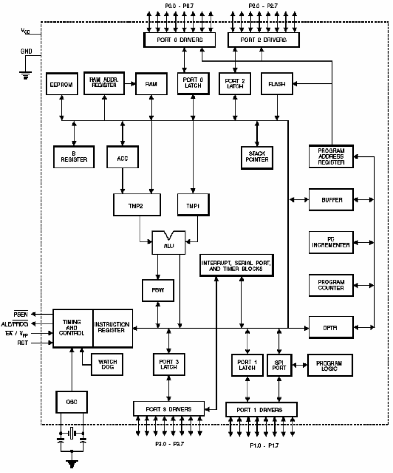

==== Port 1
Port 1 is an 8-bit bi-directional I/O port with internal pull-ups. The Port 1 output buffers can sink/source four TTL inputs. When 1s are written to Port 1 pins, they are pulled high by the internal pull-ups and can be used as inputs. As inputs, Port 1 pins that are externally being pulled low will source current (IIL) because of the internal pull-ups. Some Port 1 pins provide additional functions. P1.0 andP1.1 can be configured to be the timer/counter 2 external count input (P1.0/T2) and the timer/counter 2 trigger input (P1.1/T2EX), respectively.

Furthermore, P1.4, P1.5, P1.6, and P1.7 can be configured as the SPI slave port select, data input/output and shift clock input/output pins as shown in the following table.

|====
| **PORT PIN** | **ALTERNATE FUNCTIONS**
| P1.0 | T2 (external count input to Timer/Counter 2), clock-out
| P1.1 | T2EX (Timer/Counter 2 capture/reload trigger and direction control)
| P1.4 | SS (Slave port select input)
| P1.5 | MOSI (Master data output, slave data input pin for SPI channel)
| P1.6 | MISO (Master data input, slave data output pin for SPI channel)
| P1.7 | SCK (Master clock output, slave clock input pin for SPI channel)
|====

Port 1 also receives the low-order address bytes during Flash programming and verification.

**PORT 2**

Port 2 is an 8-bit bi-directional I/O port with internal pull-ups. The Port 2 output buffers can sink/source four TTL inputs. When 1s are written to Port 2 pins, they are pulled high by the internal pull-ups and can be used as inputs. As inputs, Port 2 pins that are externally being pulled low will source current (IIL) because of the internal pull-ups. Port 2 emits the high-order address byte during fetches from external program memory and during accesses to external data memory that uses 16-bit addresses (MOVX @ DPTR). In this application, Port 2 uses strong internal pull-ups when emitting 1s. During accesses to external data memory that uses 8-bit addresses (MOVX @ RI), Port 2 emits the contents of the P2 Special Function Register. Port 2 also receives the high-order address bits and some control signals during Flash programming and verification.

**PORT 3**

Port 3 is an 8 bit bi-directional I/O port with internal pull-ups. The Port 3 output buffers can sink/source four TTL inputs. When 1s are written to Port 3 pins, they are pulled high by the internal pull-ups and can be used as inputs. As inputs, Port 3 pins that are externally being pulled low will source current (IIL) because of the pull-ups. Port 3 also serves the functions of various special features of the AT89S8252, as shown in the following table. Port 3 also receives some control signals for Flash programming and verification.

|====
| **PORT PIN** | **ALTERNATE FUNCTIONS**
| P3.0 | RXD (serial input port)
| P3.1 | TXD (serial output port)
| P3.2 | INT0 (external interrupt 0)
| P3.3 | INT1 (external interrupt 1)
| P3.4 | T0 (timer 0 external input)
| P3.5 | T1 (timer 1 external input)
| P3.6 | WR (external data memory write strobe)
| P3.7 | RD (external data memory read strobe)
|====

**RST**
Reset input. A high on this pin for two machine cycles while the oscillator is running resets the device.

**ALE/PROG**
Address Latch Enable is an output pulse for latching the low byte of the address during accesses to external memory. This pin is also the program pulse input (PROG) during Flash programming.

In normal operation, ALE is emitted at a constant rate of 1/6 the oscillator frequency and may be used for external timing or clocking purposes. Note, however, that one ALE pulse is skipped during each access to external data memory. If desired, ALE operation can be disabled by setting bit 0 of SFR location 8EH. With the bit set, ALE is active only during a MOVX or MOVC instruction. Otherwise, the pin is weakly pulled high. Setting the ALE-disable bit has no effect if the microcontroller is in external execution mode.

**PSEN**
Program Store Enable is the read strobe to external program memory. When the AT89S8252 is executing code from external program memory, PSEN is activated twice each machine cycle, except that two PSEN activations are skipped during each access to external data memory.

**EA/VPP**

**External Access Enable**. EA must be strapped to GND in order to enable the device to fetch code from external program memory locations starting at 0000H up to FFFFH. Note, however, that if lock bit 1 is programmed, EA will be internally latched on reset. EA should be strapped to VCC for internal program executions. This pin also receives the 12-volt programming enable voltage (VPP) during Flash programming when 12 volt programming is selected.

**XTAL1** Input to the inverting oscillator amplifier and to the internal clock circuit.

**XTAL2** Output from the inverting oscillator amplifier.

==== DATA MEMORY – EEPROM AND RAM
The AT89S8252 implements 2K bytes of on-chip EEPROM for data storage and 256 bytes of RAM. The upper 128 bytes of RAM occupy a parallel space to the Special Function Registers. That means the upper 128 bytes have the same addresses as the SFR space but are physically separate from SFR space. When an instruction accesses an internal location above address 7FH, the address mode used in the instruction specifies whether the CPU accesses the upper 128 bytes of RAM or the SFR space.

Instructions that use direct addressing access SFR space. For example, the following direct addressing instruction accesses the SFR at location 0A0H (which is P2).MOV 0A0H, #data Instructions that use indirect addressing access the upper 128 bytes of RAM. For example, the following indirect addressing instruction, where R0 contains 0A0H, accesses the data byte at address 0A0H, rather than P2 (whose address is 0A0H).

Ex: MOV @R0, #data

Note that stack operations are examples of indirect addressing, so the upper 128 bytes of data RAM are available as stack space. The on-chip EEPROM data memory is selected by setting the EEMEN bit in the WMCON register at SFR address location 96H. The EEPROM address range is from 000H to 7FFH. The MOVX instructions are used to access the EEPROM. To access off-chip data memory with the MOVX instructions, the EEMEN bit needs to be set to **"0"**.

The EEMWE bit in the WMCON register needs to be set to “1” before any byte location in the EEPROM can be written. User software should reset EEMWE bit to “0” if no further EEPROM write is required. EEPROM write cycles in the serial programming mode are self-timed and typically take 2.5 ms. The progress of EEPROM write can be monitored by reading the RDY/BSY bit (read-only) in SFR WMCON.

**RDY/BSY = 0 means programming is still in progress and**

**RDY/BSY = 1 means EEPROM write cycle is completed and another write cycle can be initiated.**

In addition, during EEPROM programming, an attempted read from the EEPROM will fetch the byte being written with the MSB complemented. Once the write cycle is completed, true data are valid at all bit locations.

**PROGRAMMABLE WATCHDOG TIMER**

The programmable Watchdog Timer (WDT) operates from an independent oscillator. The pre scaled bits, PS0, PS1 and PS2 in SFR WMCON are used to set the period of the Watchdog Timer from 16 ms to 2048 ms. The available timer periods are shown in the following table and the actual timer periods (at VCC = 5V) are within ±30% of the nominal. The WDT is disabled by Power-on Reset and during Power-down. It is enabled by setting the WDTEN bit in SFR WMCON (address = 96H). The WDT is reset by setting the WDTRST bit in WMCON. When the WDT times out without being reset or disabled, an internal RST pulse is generated to reset the CPU.

**TIMER 0 AND 1**

Timer 0 and Timer 1 in the AT89S8252 operate the same way as Timer 0 and Timer 1 in the AT89C51, AT89C52 and AT89C55

**TIMER 2**

Timer 2 is a 16 bit Timer/Counter that can operate as either a timer or an event counter. The type of operation is selected by bit C/T2 in the SFR T2CON. Timer 2 has three operating modes: capture, auto-reload (up or down counting), and baud rate generator. The modes are selected by bits in T2CON, as shown in Table 8. Timer 2 consists of two 8-bit registers, TH2 and TL2. In the Timer function, the TL2 register is incremented every machine cycle. Since a machine cycle consists of 12 oscillator periods, the count rate is 1/12 of the oscillator frequency.

In the Counter function, the register is incremented in response to a 1-to-0 transition at its corresponding external input pin, T2. In this function, the external input is sampled during S5P2 of every machine cycle. When the samples show a high in one cycle and a low in the next cycle, the count is incremented. The new count value appears in the register during S3P1 of the cycle following the one in which the transition was detected. Since two machine cycles (24 oscillator periods) are required to recognize a 1-to-0 transition, the maximum count rate is 1/24 of the oscillator frequency. To ensure that a given level is sampled at least once before it changes, the level should be held for at least one full machine cycle.

**SERIAL PERIPHERAL INTERFACE**

The serial peripheral interface (SPI) allows high-speed synchronous data transfer between the AT89S8252 and peripheral devices or between several AT89S8252 devices. The AT89S8252 SPI features include the following:

. Full-Duplex, 3-Wire Synchronous Data Transfer
. Master or Slave Operation
. 1.5 MHz Bit Frequency (max.)
. LSB First or MSB First Data Transfer
. Four Programmable Bit Rates
. End of Transmission Interrupt Flag
. Write Collision Flag Protection
. Wakeup from Idle Mode (Slave Mode Only)

The interconnection between master and slave CPUs with SPI is shown in the following figure.

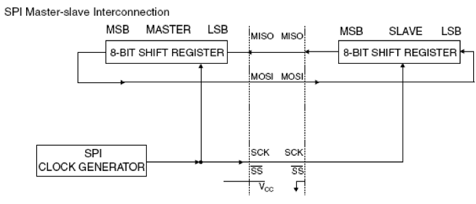

The SCK pin is the clock output in the master mode but is the clock input in the slave mode. Writing to the SPI data register of the master CPU starts the SPI clock generator, and the data written shifts out of the MOSI pin and into the MOSI pin of the slave CPU. After shifting one byte, the SPI clock generator stops, setting the end of transmission flag (SPIF). If both the SPI interrupt enable bit (SPIE) and the serial port interrupt enable bit (ES) are set, an interrupt is requested. The Slave Select input, SS/P1.4, is set low to select an individual SPI device as a slave. When SS/P1.4 is set high, the SPI port is deactivated and the MOSI/P1.5 pin can be used as an input. There are four combinations of SCK phase and polarity with respect to serial data, which are determined by control bits CPHA and CPOL.

**INTERRUPTS**

The AT89S8252 has a total of six interrupt vectors: two external interrupts (INT0 and INT1), three timer interrupts (Timers 0, 1, and 2), and the serial port interrupt. These interrupts are all shown in Figure 10. Each of these interrupt sources can be individually enabled or disabled by setting or clearing a bit in Special Function Register IE. IE also contains a global disable bit, EA, which disables all interrupts at once. Note that Table 10 shows that bit position IE.6 is unimplemented. In the AT89C51, bit position IE.5 is also unimplemented. User software should not write 1s to these bit positions, since they may be used in future AT89products. Timer 2 interrupt is generated by the logical OR of bits TF2 and EXF2 in register T2CON.

Neither of these flags is cleared by hardware when the service routine is vectored to. In fact, the service routine may have to determine whether it was TF2 or EXF2 that generated the interrupt, and that bit will have to be cleared in software. The Timer 0 and Timer 1 flags, TF0 and TF1, are set at S5P2 of the cycle in which the timers overflow. The values are then polled by the circuitry in the next cycle. However, the Timer 2 flag, TF2, is set at S2P2 and is polled in the same cycle in which the timer overflows.

**OSCILLATOR CHARACTERISTICS**

XTAL1 and XTAL2 are the input and output, respectively, of an inverting amplifier that can be configured for use as an on-chip oscillator, as shown in Figure 11. Either quartz crystal or ceramic resonator may be used. To drive the device from an external clock source, XTAL2 should be left unconnected while XTAL1 is driven. There are no requirements on the duty cycle of the external clock signal, since the input to the internal clocking circuitry is through a divide-by-two flip-flop, but minimum & maximum voltage, high and low time specifications must be observed.

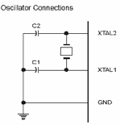

==== IDLE MODE
In idle mode, the CPU puts itself to sleep while all the on-chip peripherals remain active. The mode is invoked by software. The content of the on-chip RAM and the entire special functions registers remain unchanged during this mode. The idle mode can be terminated by any enabled Interrupt or by hardware reset. It should be noted that when idle is terminated by a hard were reset, the device normally resumes program execution, from where it left off, up to two machine cycles before the internal reset algorithm takes control. On-chip hardware inhibits access to internal RAM in this event, but access to the port pins is not inhibited. To eliminate the possibility of an unexpected write to a port pin when Idle is terminated by reset, the instruction following the one that invokes Idle should not be one that writes to a port pin or to external memory

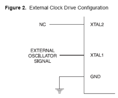

==== STATUS OF EXTERNAL PINS DURING IDLE AND POWER-DOWN MODES
|====
| **MODE** | **PROGRAM MEMORY** | **ALE** | **PSEN** | **PORT0** | **PORT1** | **PORT2** | **PORT3**
| Idle | Internal | 1 | 1 | Data | Data | Data | Data
| Idle | External | 1 | 1 | Float | Data | Address | Data
| Power-down | Internal | 0 | 0 | Data | Data | Data | Data
| Power-down | External | 0 | 0 | float | Data | Data | Data
|====

==== POWER-DOWN MODE
In the power-down mode, the oscillator is stopped, and the instruction that invokes power-down is the last instruction executed. The on-chip RAM and Special Function Registers retain their values until the power-down mode is terminated. The only exit from power-down is a hardware reset. Reset redefines the SFRs but does not change the on-chip RAM. The reset should not be activated before VCC is restored to its normal operating level and must be held active long enough to allow the oscillator to restart and stabilize.

==== DC MOTOR – AN OVERVIEW
The DC motor has two basic parts: the rotating part that is called the _armature_ and the stationary part that includes coils of wire called the _field coils_. The stationary part is also called the _stator_.  The armature is made of coils of wire wrapped around the core, and the core has an extended shaft that rotates on bearings. The ends of each coil of wire on the armature are terminated at one end of the armature. The termination points are called the _commutator_, and this is where the brushes make electrical contact to bring electrical current from the stationary part to the rotating part of the machine.

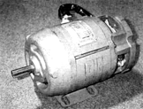

The coils are mounted inside the stator. These coils are referred to as field coils and they may be connected in series or parallel with each other to create changes of torque in the motor. The size of wire in these coils and the number of turns of wire in the coil will depend on the effect that is trying to be achieved. The armature of a DC motor has coils of wire wrapped around its core. The ends of each coil are terminated at commutator segments located on the left end of the shaft. The brushes make contact on the commutator to provide current for the armature.

**FIELD COILS**
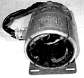

**Armature of a DC motor**
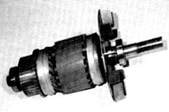

==== Magnetic Diagram of a DC Motor
In below figure it is seen that a bar magnet has been mounted on a shaft so that it can spin. The field winding is one long coil of wire that has been separated into two sections. The top section is connected to the positive pole of the battery and the bottom section is connected to the negative pole of the battery. It is important to understand that the battery represents a source of voltage for this winding. In the actual industrial-type motor this voltage will come from the DC voltage source for the motor. The current flow in this direction makes the top coil the north pole of the magnet and the bottom coil the south pole of the magnet.

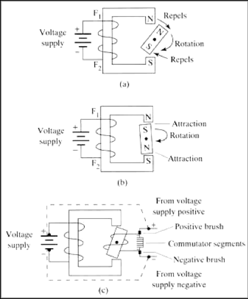

**(a) Magnetic diagram that explains the operation of a DC motor. The rotating magnet moves clockwise because like poles repel.
(b) The rotating magnet is being attracted because the poles are unlike. 
(c) The rotating magnet is now shown as the armature coil, and its polarity is determined by the brushes and commutator segments.**

The bar magnet represents the armature and the coil of wire represents the field. The arrow shows the direction of the armature's rotation. The arrow shows the armature starting to rotate in the clockwise direction. The north pole of the field coil is repelling the north pole of the armature, and the south pole of the field coil is repelling the south pole of the armature.

As the armature begins to move, the north pole of the armature comes closer to the south pole of the field, and the south pole of the armature is coming closer to the north pole of the field. As the two unlike poles near each other, they begin to attract. This attraction becomes stronger until the armature's north-pole moves directly in line with the field's south-pole, and its south-pole moves directly in line with the field's north-pole (Fig. 12b).

When the opposite poles are at their strongest attraction, the armature will be "locked up" and will resist further attempts to continue spinning. For the armature to continue its rotation, the armature's polarity must be switched. Since the armature in this diagram is a permanent magnet, it would lock up during the first rotation and not work. If the armature is an electromagnet, its polarity can be changed by changing the direction of current flow through it. For this reason the armature must be changed to a coil (electromagnet) and a set of commutator segments must be added to provide a means of making contact between the rotating member and the stationary member. One commutator segment is provided for each terminal of the magnetic coil. Since this armature has only one coil, it will have only two terminals, so the commutator has two segments.

Since the armature is now a coil of wire, it will need DC current flowing through it to become magnetized. This presents another problem; since the armature will be rotating, the DC voltage wires cannot be connected directly to the armature coil. A stationary set of carbon brushes is used to make contact to the rotating armature. The brushes ride on the commutator segments to make contact so that current will flow through the armature coil.

In Fig. 12c it is seen that the DC voltage is applied to the field and to the brushes. Since negative DC voltage is connected to one of the brushes, the commutator segment the negative brush rides on will also be negative. The armature's magnetic field causes the armature to begin to rotate. This time when the armature gets to the point where it becomes locked up with the magnetic field, the negative brush begins to touch the end of the armature coil that was previously positive and the positive brush begins to touch the end of the armature coil that was negative. This action switches the direction of current flow through the armature, which also switches the polarity of the armature coil's magnetic field at just the right time so that the repelling and attracting continues. The armature continues to switch its magnetic polarity twice during each rotation, which causes it to continually be attracted and repelled with the field poles.

This is a simple two-pole motor that is used primarily for instructional purposes. Since the motor has only two poles, the motor will operate rather roughly and not provide too much torque. Additional field poles and armature poles must be added to the motor for it to become useful for industry.

=== DC SHUNT MOTORS

===== ELECTRICAL DIAGRAM OF A SHUNT MOTOR

The shunt motor is different from the series motor in that the field winding is connected in parallel with the armature instead of in series. Since the field winding is placed in parallel with the armature, it is called a shunt winding and the motor is called a shunt motor. Figure 12-1 shows a diagram of a shunt motor. Notice that the field terminals are marked Fl and F2, and the armature terminals are marked Al and A2.

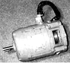

The shunt winding is made of small-gauge wire with many turns on the coil. Since the wire is so small, the coil can have thousands of turns and still fit in the slots. The small-gauge wire cannot handle as much current as the heavy-gauge wire in the series field, but since this coil has many more turns of wire, it can still produce a very strong magnetic field.

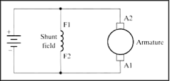
**Diagram of DC shunt motor**

=== SHUNT MOTOR OPERATION
A shunt motor has slightly different operating characteristics than a series motor. Since the shunt field coil is made of fine wire, it cannot produce the large current for starting like the series field. This means that the shunt motor has very low starting torque, which requires that the shaft load be rather small.

When voltage is applied to the motor, the high resistance of the shunt coil keeps the overall current flow low. The armature for the shunt motor is similar to the series motor and it will draw current to produce a magnetic field strong enough to cause the armature shaft and load to start turning. Like the series motor, when the armature begins to turn, it will produce back EMF. The back EMF will cause the current in the armature to begin to diminish to a very small level. The amount of current the armature will draw is directly related to the size of the load when the motor reaches full speed. Since the load is generally small, the armature current will be small. When the motor reaches full RPM, its speed will remain fairly constant.

==== CONTROLLING THE SPEED
When the shunt motor reaches full RPM, its speed will remain fairly constant. The reason the speed remains constant is due to the load characteristics of the armature and shunt coil. The speed of a series motor could not be controlled since it was totally dependent on the size of the load in comparison to the size of the motor. If the load was very large for the motor size, the speed of the armature would be very slow. If the load was light compared to the motor, the armature shaft speed would be much faster, and if no load was present on the shaft, the motor could run away.
 
The shunt motor's speed can be controlled. The ability of the motor is to maintain **a set RPM** at high speed, where the load changes are due to the characteristics of the shunt field and armature. Since the armature begins to produce back EMF as soon as it starts to rotate, it will use the back EMF to maintain its RPM at high speed. If the load increases slightly and causes the armature shaft to slow down, less back EMF will be produced. This will allow the difference between the back EMF and applied voltage to become larger, which will cause more current to flow. The extra current provides the motor with the extra torque required to regain its RPM when this load is increased slightly.
 
The shunt motor's speed can be varied in two different ways. These include varying the amount of current supplied to the shunt field and controlling the amount of current supplied to the armature. Controlling the current to the shunt field allows the RPM to be changed 10-20% when the motor is at full RPM.
 
This type of speed control regulation is accomplished by slightly increasing or decreasing the voltage applied to the field. The armature continues to have full voltage applied to it while the current to the shunt field is regulated by a rheostat that is connected in series with the shunt field. When the shunt field's current is decreased, the motor's RPM will increase slightly. When the shunt field's current is reduced, the armature must rotate faster to produce the same amount of back EMF to keep the load turning.

The shunt motor's RPM can also be controlled by regulating the voltage that is applied to the motor armature. This means that if the motor is operated on less voltage than is shown on its data plate rating, it will run at less than full RPM. The shunt motor's efficiency will drop off drastically when it is operated below its rated voltage. The motor will tend to overheat when it is operated below full voltage, so motor ventilation must be provided. The motor's torque is reduced when it is operated below the full voltage level.

=== TORQUE CHARACTERISTICS
The armature's torque increases as the motor gains speed due to the fact that the shunt motor's torque is directly proportional to the armature current. When the motor is starting and speed is very low, the motor has very little torque. After the motor reaches full RPM, its torque is at its fullest potential. This type of automatic control makes the shunt motor a good choice for applications where **constant speed is required**, even though the torque will vary slightly due to changes in the load. The speed of the shunt motor stays fairly constant throughout its load range and drops slightly when it is drawing the largest current.

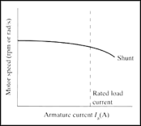

==== REVERSING THE ROTATION
The direction of rotation of a DC shunt motor can be reversed by changing the polarity of either the armature coil or the field coil. In this application the armature coil is usually changed, as was the case with the series motor. Figure 12-4 shows the electrical diagram of a DC shunt motor connected to a forward and reversing motor starter. The Fl and F2 terminals of the shunt field are connected directly to the power supply, and the Al and A2 terminals of the armature winding are connected to the reversing starter.

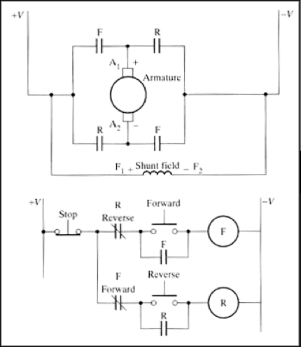

**Diagram of a shunt motor connected to a reversing motor starter. Notice that the shunt field is connected across the armature and it is not reversed when the armature is reversed.**

When the FMS is energized, its contacts connect the Al lead to the positive power supply terminal and the A2 lead to the negative power supply terminal. The Fl motor lead is connected directly to the positive terminal of the power supply and the F2 lead is connected to the negative terminal. When the motor is wired in this configuration, it will begin to run in the forward direction.

When the RMS is energized, its contacts reverse the armature wires so that the Al lead is connected to the negative power supply terminal and the A2 lead is connected to the positive power supply terminal. The field leads are connected directly to the power supply, so their polarity is not changed. Since the field's polarity has remained the same and the armature's polarity has reversed, the motor will begin to rotate in the reverse direction. The control part of the diagram shows that when the FMS coil is energized, the RMS coil is locked out. 

==== ADVANTAGES OF SHUNT MOTOR
. Low Power Consumption
. Light in weight
. Better torque control
. Current rating is lesser

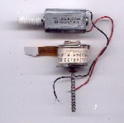

**RATING**

|====
| **VOLTAGE** | 5 -12 V
| **CURRENT** | 500 MA
| **TYPE** | SHUNT
|====

Integrated circuits are commonly employed in conjunction with stabilized DC power supplies. Regulators are invariably of the three terminal type and may be either fixed or variable voltage types.

Most regulators incorporate current limiting and thermal shutdown. Various fixed voltage regulators are7805, 7905, 7809, 7909, 7812, 7912, 7815, 7915, 7824, 7924 etc.,

Here are 7 output voltage options such as 5, 6, 8, 12, 15, 18 and 24 volts. In 78xx, the last two members (xx) indicate the output voltage. Thus 7805 represents 5V regulator.

The regulators are available in two types of packages. They are:

. Metal Package
. Plastic Package
 
The three characteristics of three terminal regulators are:

. **LOAD REGULATION**
It is the change in output voltage for a change in the load current.
. **LINE REGULATION**
It is the percentage change in the output voltage for a change in the input voltage.
. **RIPPLE REJECTION**
The IC regulator reduces the ripple voltage also.
 
In the vast majority of applications, voltage regulators will operate at significant power levels. It is essential to provide adequate heat sinking (following the manufacturer’s recommendation). Failure to observe this precaution may result in premature current limiting or output voltage fold back due to thermal shutdown.
 
==Chapter 4: Schematic Designs

===== POWER SUPPLY CIRCUIT USING IC 7805

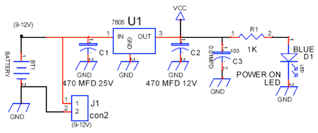

The power for this circuit is taken from a 9V DC supply and connected into 5V stabilized DC using IC 7805. The output of 7805 is connected to “power on” LED and a capacitor to smoothen the supply voltage. IC 7805 3-pin voltage regulator was selected for this circuit because of its versatility. It is short circuit proof, can accept input voltage up to 24V DC with a minimum of 9V input and can supply 1 Amp of current with a heat sink if required. It also has reverse voltage protection and almost impossible to destroy electrically. It looks like a small transistor and is capable of providing upto 100 mA of maximum current. This can be used when the total current required by the circuit less than 100 mA. 

Voltage regulators have considerable internal gain and thus, to ensure unconditional high frequency stability, it is recommended that relatively low value (e.g. 100 nF) capacitors be fitted( from input to ground and from output to ground) as close as possible to the device.

Care should be taken to ensure that the (unregulated) DC input voltage is within the range specified by the manufacturing (e.g. +7V to +25V max for a 7805). Where the input voltage is very much higher than the output voltage, power dissipation within the regulator may be excessive.

==== SPEAKER AMPLIFIER CIRCUIT

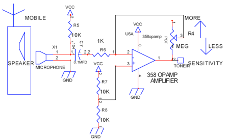

. This circuit is used to amplify the weak signal (tone generated) from the speaker of the mobile phone. 
. Since the signal obtained consists of noise it is imperative to amplify the signal to get the key tone generated accurately for decoding. 
. The key tone generated is obtained by the speaker of the mobile phone.
. It is received by the microphone which is placed just above the mobile phone.
. The two ends of the microphone are connected between ground and the amplifier circuit.
. This circuit makes use of a 358 OP-AMP for amplification.
. The positive input terminal is connected to a bridge circuit of 10K resistors to compensate for the noise factor.
. The feedback circuit is provided by a variable MEG resistor POT.
. This POT resistor is used to select a value for the resistance of the Feedback circuit in accordance with the noise is the receiving terminal.
. Thus the sensitivity is varied using the POT which gives a wide range of control of the vehicle in all kinds of environment. 

=== DTMF DECODER CIRCUIT DESIGN

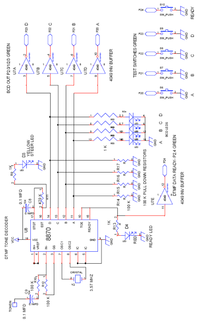

==== WORKING OF TONE DECODER CIRCUIT

. The tone out from the amplifier circuit is given to Pin 2 of IC8870, the DTMF Receiver IC – Pin 2 being the input pin.
. A crystal oscillator of frequency 3.57 MHz is connected across Pins 7 and 8 to provide the time base circuit.
. The DTMF tones must be valid for a specified duration in order to be received by the DTMF receiver and decoded in order to enable conversion to equivalent BCD output.
. Resistors R14, R15, R16 and R17 (refer circuit) are called ‘pull-down’ resistors. 
. These resistors are grounded for the following reason – IC8870 has ‘tri-state’ logic, i.e., it has three operating states, HIGH, LOW and FLOATING. 
. In the event that IC8870 is in the floating state, this floating output of 8870 will be given to the flip-flops, causing them to oscillate. 
. Since, this is undesirable, the ‘pull-down’ resistors are used to prevent oscillation.
. The binary input at Pin 2 is converted into 4-bit BCD outputs, which are taken from Pins 11, 12, 13 and 14. 
. Output at Pin 11 is the LSB and that at Pin 14 is the MSB.
. The output from the four pins is given to the microcontroller circuit through IC4049 buffer circuits.
. The output from the pin 14 & 15 are given to a LED to determine the DATA READY signal.
. In case of testing, four test switches are also provided in order to test the DTMF Receiver circuit.

=== MICROCONTROLLER CIRCUIT

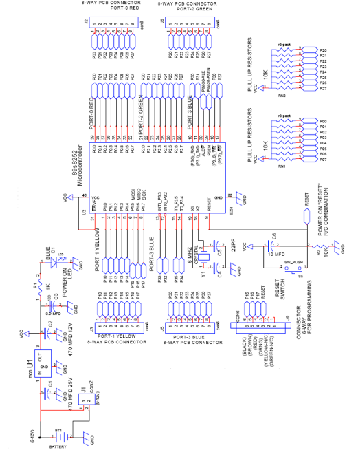

==== WORKING OF MICROCONTROLLER CIRCUIT

. The circuit uses IC7805 for a stabilized 5v dc supply with a ripple smoothening capacitor C1. 
. Input to the circuit is 12v dc. 
. A power ON indicator LED D1 is used with a current limiting resistor R1.
. The circuit has two 10K resistor packs to act as “pull-up” resistors.
. Port-2(Green) is used as the Input Port which gets the input from the DTMF Receiver circuit.
. Port-0(Red) is used as the Output Port which is connected to the Driver circuit.
. Port-1(Yellow) is connected to a LED display and acts as an Output Port.
. The output of the DTMF receiver A, B, C and D are given to Port-2 at the pins P20, P21, P22 and P23.
. The output of DTMF receiver at pins 10 & 15 (Data Ready) is given to Port-2 at pin P24.
. The output Port-1, which is connected to a LED displays the DTMF code received by the microcontroller.
. These inputs are manipulated according to the microcontroller program and then the output Port-0 is connected to the Driver circuit with pins P00, P01, P02 and P03 with the driving and steering circuits.
. A reset switch is given which is connected to pin 9 of the microcontroller.
. The PCB is fabricated with four 8-way PCB connectors to facilitate further improvements.

=== DRIVER CIRCUIT DESIGN

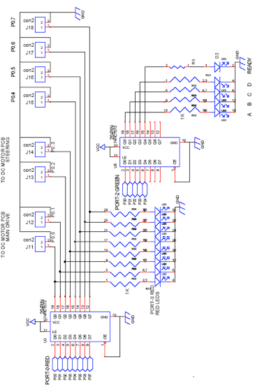

===== WORKING OF DRIVER CIRCUIT
. The driver circuit acts as the interface between the static medium and mechanical medium.
. The driver circuit holds the buffer IC’s, display devices and the data transfer from the microcontroller to the driving and steering circuits.
. In order to connect the Input Port-2 of the microcontroller to the DTMF receiver, IC 74HCT573 is used and is also connected to a LED display to determine the four bit input data transferred.
. The Output Port-0 which is connected to the driving and steering circuits is needed to transfer only two bit data to each circuit.
. The two bit data from the pins P0.0 and P0.1 are given to the DC motor main drive which is responsible for the forward and reverse direction.
. The pins P0.0 and P0.1 are used to give the values for LEFT and RIGHT for the DC motor driving circuit.
. The two bit data from the pins P0.2 and P0.3 are given to the DC motor steering drive which is responsible for left and right steering movements.
. The pins P0.2and P0.3 are used to give the values for RUN and DIRECTION for the DC motor steering circuit.
. This four bit data is given by the Output Port-0 to the motor driving and steering circuits through another IC 74HCT573 buffer 
. This buffer IC is also provided with a LED display for the output port.
. The two LED displays are provided with 1K “pull-down” resistors
. The other four pins of the Port-0 are left to facilitate further developments.

=== DC MOTOR DRIVE CIRCUIT

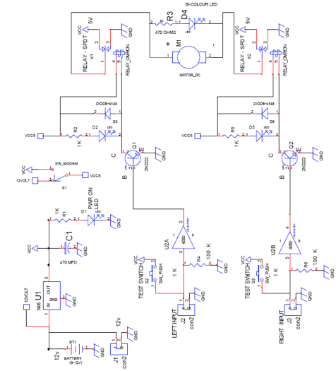

===== WORKING OF MOTOR-DRIVE CIRCUIT
. The circuit uses 7805 for a stabilized 5v dc supply with a ripple smoothening capacitor C1. 
. Input to the circuit is 12v dc. 
. A power ON indicator led D1 is used with a current limiting resistor R1. 
. The circuit has two logic inputs marked as RUN and DIRECTION. 
. A dc motor rated at 5v is connected using two 12volt relays for direction change and another relay is used to supply power to the motor.
.  When the DIR relay (k1 12v) is ON power supply (5v) goes to the DC motor where the direction is in one way. 
. When the DIR relay and relays K2 K3 are energized the motor runs in the other way because of the connection change in polarity. 
. If only the DIR relay is energized - the motor does not rotate because the supply is cut off by relay K1.
. Relay energizing indicator is also provided through an LED & back emf diodes (1N4148) are placed across relay coils. 
. As shown in schematic two logic input connectors are provided through two way cables into the PCB. 
. Two non inverting buffers ic4050 are used with pull down resistors (100k) to keep the logic low. 
. When testing without the sensors two test switches are also provided to simulate the input action, the output of 4050 is used to bias the transistors. 
. No bias resistor is used, since the ic4050 has built in 330  resistors as per CMOS logic gate standards.

=== DC MOTOR STEERING CIRCUIT

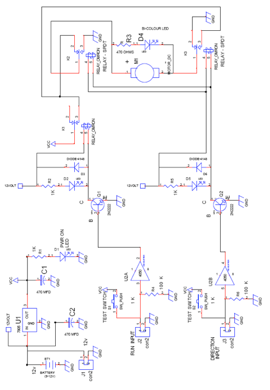

===== WORKING OF STEERING-4 CIRCUIT

. The circuit uses 7805 for a stabilized 5v dc supply with a ripple smoothening capacitor C1 with input to the circuit being 12v dc.
. A power ON indicator led D1 is used with a current limiting resistor R1. 
. The steering mechanism has a built in dc motor rated at 5v, which consumes approximately 100mA current. 
. When the motor is rotated in one direction for one second the steering mechanism moves 2 wheels in one angle.
. If the polarity is reversed to the motor the wheels move in other direction. 
. The motor has a gear/ clutch mechanism built in. So, even if the power is given for greater than one second the clutch slips& does damage the motor. 
. To operate this dc motor we require 2 SPDT relays, which can supply power of either polarity of dc motor. 
. When any one of them is energized see (relay K1 & K2) (in schematic) R3 & D4 (bicolor LED) one placed across the motor to indicate red/ green to show the clockwise/anticlockwise rotation.
. Since the 2 relays provide opposite polarity voltage to the steering motor only one relay at a time should be energized. 
. When both the relays are ON or OFF, no power is supplied to the motor. Relay energizing indicator is also provided through an LED & back emf diodes (1N4148) are placed across relay coils. 
. As shown in schematic, left & right logic input connectors are used which can be connected through two way cables into the PCB. 
. Two non-inverting buffers ic4050 are used with pull down resistors (100k) to keep the logic low. 
. When testing without the sensors two test switches are also provided to simulate the sensor action, the output of 4050 is used to bias the transistors. 
. No bias resistor is used, since the IC4050 has built in 330 ohms resistors as per CMOS logic gate standards.

=== DATA FLOW DIAGRAM

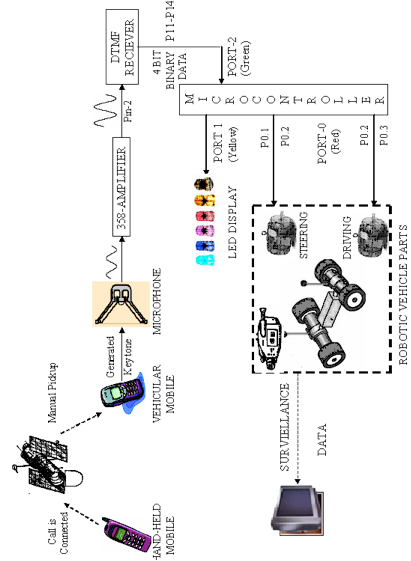

===== DATA FLOW DIAGRAM- EXPLAINATION

. The ROBOTIC VEHICLE is fitted with a mobile phone and another hand-held mobile phone is used as the remoter control.
. A call is made to the mobile on the robot and picked up manually. 
. The pre-defined keys pressed generate the DTMF tones which are received by the mobile in the robotic vehicle.
. The key tones generated are heard in the ear-piece of the vehicular mobile.
. A microphone is placed which acoustically detects the tones generated in the earphone of the mobile.
. The received key-tones are amplified by the 358 Amplifier.
. Then the amplified signal tones are sent to the tone decoder circuit.
. The tone out from the amplifier circuit is given to Pin 2 of IC8870, the DTMF Receiver where Pin 2 is the tone input pin.
. The DTMF tones must be valid for a specified duration in order to be received by the DTMF receiver and decoded in order to enable conversion to its equivalent 4-bit BCD output.
. The binary input at Pin 2 is converted into their BCD outputs, which are taken from Pins 11, 12, 13 and 14 of the DTMF Receiver. 
. The DATA READY signal from pins 14 & 15 are also given to the microcontroller in the input port at P24. 
. The output of the DTMF receiver A, B, C and D are given to Port-2 at the pins P20, P21, P22 and P23 of the microcontroller.
. The output Port-1, which is connected to a LED displays the DTMF code received by the microcontroller.
. These inputs are processed by the microcontroller program and outputs are determined and given through the output port.
. The output port (Port-0) is connected to the Driver circuit with pins P00, P01, P02 and P03 with the driving and steering circuits.
. The microcontroller sends appropriate signals to the MOTOR AND STEERING DRIVES (robotic motion controls) through the driver circuit
. The DRIVER CIRCUIT acts as the interface between the static medium and mechanical medium.
. The two bit data from the pins P0.0 and P0.1 are given to the DC motor main drive which is responsible for the forward and reverse direction.
. These are used to give the values for LEFT and RIGHT for the DC motor driving circuit.
. The two bit data from the pins P0.2 and P0.3 are given to the DC motor steering drive which is responsible for left and right steering movements.
. These are used to give the values for RUN and DIRECTION for the DC motor steering circuit.
. Thus the navigation of the robotic vehicle is performed.
. Keys assigned for control are 

|====
| **1** | **3** | **2** | **8** | **4** | **6**
| START | STOP | FORWARD | REVERSE | LEFT | RIGHT
|====

. The micro controller is programmed for auto-surveillance and manual maneuvers, using the keys ‘*’ and ‘#’.
. A mini wireless camera can be placed in front of the vehicle, to transmit continuous video and/or audio.
. It is received by any small TV kept near the remote mobile to help in navigating the mobile when it is not within visible range.

==== MICROCONTROLLER PROGRAM

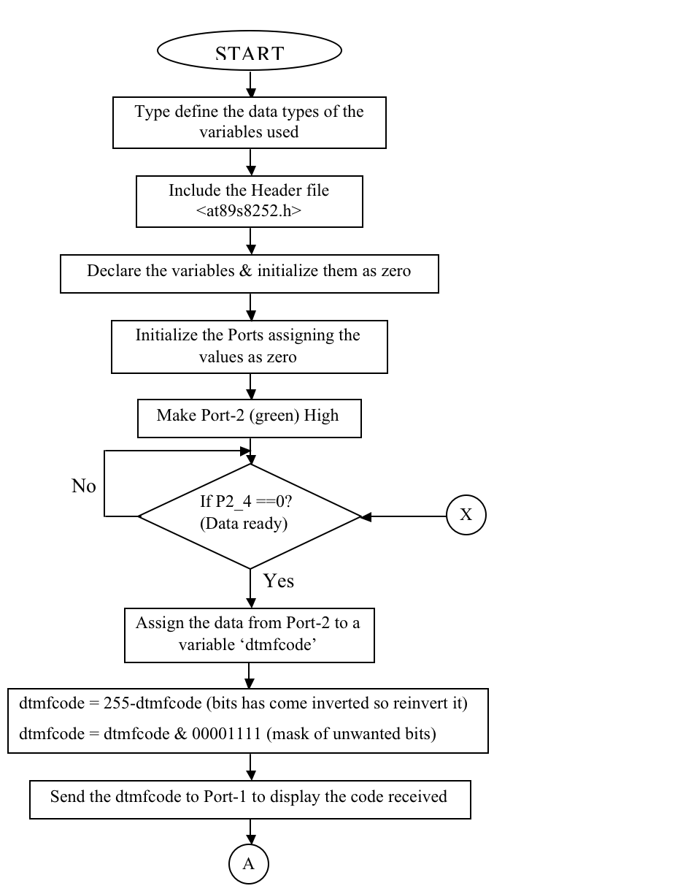

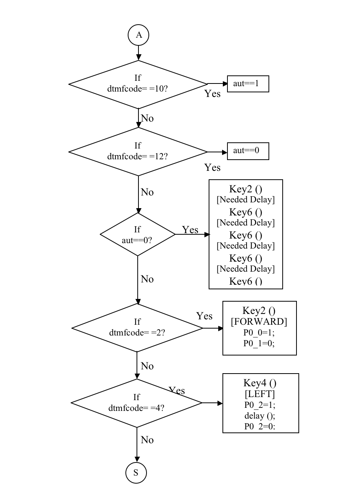

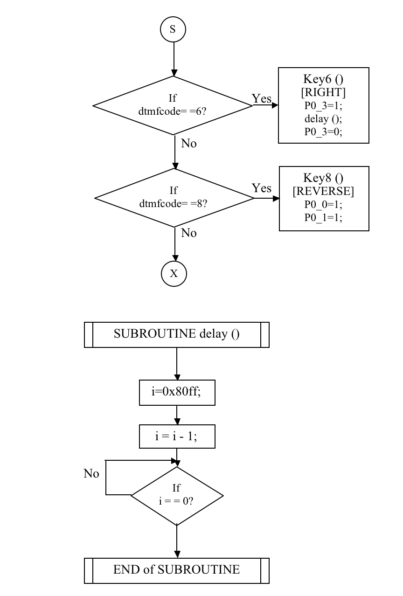

==== LIVE DEMONSTRATION – FEATURES

In order to demonstrate the application of this project a working model of approximately 12” long and 6”high is made. A simple prototype of the proposed mobile-controlled robotic vehicle is constructed and fitted with the following components:

. VEHICLUAR MOBILE PHONE
. CARBON MICROPHONE
. IC-358 AMPLIFIER
. IC-78xx VOLTAGE REGULATOR
. IC-8870 DTMF DECODER CIRCUIT 
. 89s8252 MICROCONTROLLER CIRCUIT
. DRIVER & BUFFER CIRCUIT 
. DC MOTOR MAIN DRIVE CIRCUIT
. DC MOTOR STEERING DRIVE CIRCUIT

In order to navigate the robotic vehicle a mini wireless camera is placed in the vehicle. This camera provides a continuous feed to a small TV which is set near the hand-held mobile, which acts as the remote control for the robotic vehicle.
This prototype can have a wide range of applications for domestic surveillance to military warfare needs. In case of self-destruction purposes, key ’0’ can be used when used in military warfare. For domestic purposes, it can be utilized for local surveillance and for visual transmission of local scenario in the required localities in factories and in offices. 
The power supply required for the circuit was 12V. Hence a regulated power supply circuit to supply 12V is designed with IC7812 for this purpose.

==== MOBILE ROBOT LEGEND

image::images/Image-230716-091509.942.png[]

=== FUTURISTIC DEVELOPMENTS

. This project mainly concentrates on its application in military and other surveillance needs. It may be developed for further applications like fire detection, underground mine detection etc.,
. It can be further improved by enabling the user to close doors, windows or trip circuits on detecting a breach in security during surveillance.
. For surveillance it can also programmed to trip alarms automatically when sensing a change in environment (using a temperature sensor) and also can be used to control devices according to the need of the user.
. It can also be improved for providing a secure line by using a multi-key password.
. In this project the call is manually picked-up. However it can be programmed to auto- pick the call and detect the correct user.
. Now with the advent CDMA and latest mobile phones, the mobile phone can be designed to send the video feed directly to the WAP enabled mobile phone.
. The commands can be converted to a voice-detection scheme where instead of keystrokes voice commands can be used to control the device.
. The application of this project can be extended far and wide from huge industries to museums to domestic surveillance.
. In huge industries it does not require high power, technically equipped people and visible range to operate it.
. It can also be programmed to auto-dial pre-defined numbers if there had been a security breach either to the user and/or the nearest security personnel.

==== References
. **ELECTRONIC INSTRUMENTATION** - By H.S.Kalsi, Tata McGraw-Hill Publishing Limited, New Delhi
. **EMBEDDED SYSTEMS DESIGN USING 8051** - By Romania Kalpathi & Ganesh Raja, Srimagal Publications
. **PRINCIPLES OF ELECTRICAL ENGINEERING** - By B.R.Gupta, S.Chand & Company LTD
. **How Cell Phones Work - by Marshall Brain and Jeff Tyson**
http://electronics.howstuffworks.com/cellphones.htm
. **How do microphones work, and why are there so many different types?**
http://electronics.howstuffworks.com/question309.htm
. **DTMF RECIEVER**
.. www.chipdocs.com/pndecoder/datasheets/CPCLA/M-8870-01SMTR.html
.. www.mastertronics.com.br/datasheets/M8880.pdf
.. http://engineering.trapeka.com/electronics/circuits/telephone/t1.html
. **MICROCONTROLLER**
.. http://www.atmel.com/products/8051/
.. www.8052.com
.. www.sunequipco.com/Microprocessor/MTS-8052.HTM
. **DC MOTORS**
.. www.dcmotorsinc.com 
.. www.howstuffworks.com/motor.htm
.. www.dc-motors.net
